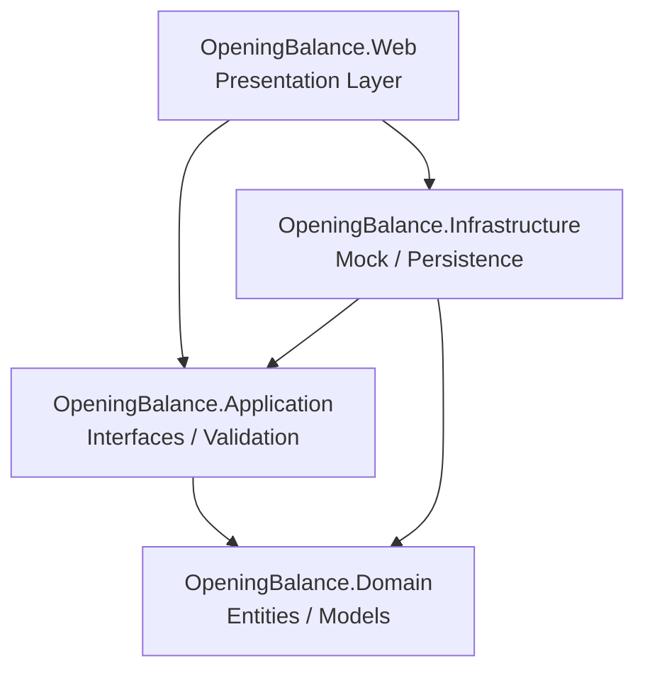
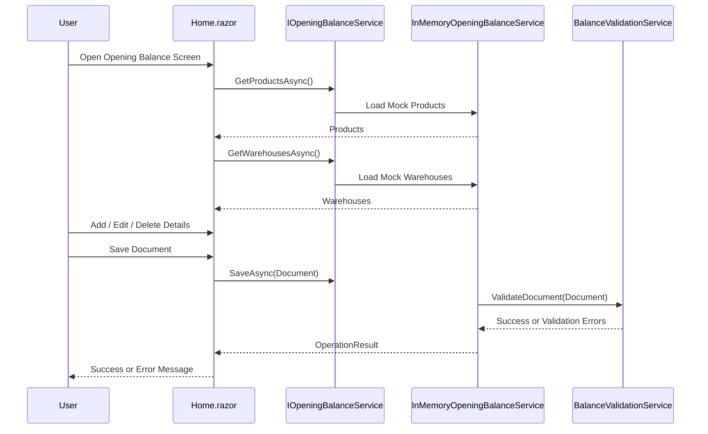

# Opening Balance Management

> Feature لإدارة الأرصدة الافتتاحية للمخزون، مبنية باستخدام Blazor Web App وClean Architecture مع واجهة عربية RTL وMock Data.

---

## Technology Stack

<div align="center">

[](https://dotnet.microsoft.com/)[](https://learn.microsoft.com/aspnet/core/)[](https://learn.microsoft.com/aspnet/core/blazor/)[](https://learn.microsoft.com/dotnet/csharp/)

[](https://learn.microsoft.com/aspnet/core/blazor/components/)[](https://learn.microsoft.com/dotnet/architecture/)[](#)[](https://learn.microsoft.com/aspnet/core/fundamentals/dependency-injection)

[](https://developer.mozilla.org/docs/Web/HTML)[](https://developer.mozilla.org/docs/Web/CSS)[](#)[](#)[](https://git-scm.com/)

</div>

| Technology | Usage in the Project |
| --- | --- |
| `.NET 9` | تشغيل وبناء Solution والمشاريع الأربعة. |
| `ASP.NET Core` | استضافة تطبيق الويب وإعداد Dependency Injection وRazor Components. |
| `Blazor Web App` | بناء الواجهة التفاعلية باستخدام Razor Components. |
| `Interactive Server` | تشغيل الصفحة بتفاعل Server دون إعادة تحميل كامل للصفحة. |
| `C#` | لغة البرمجة المستخدمة في Domain وApplication وInfrastructure وWeb. |
| `Clean Architecture` | فصل Domain وApplication وInfrastructure وPresentation. |
| `Mock Data / In-Memory` | توفير Products وWarehouses وحفظ الوثيقة مؤقتًا دون Database. |
| `HTML5 / CSS3` | بناء الواجهة وتصميم البطاقات والجداول والنوافذ التفاعلية. |
| `Arabic RTL` | دعم اللغة العربية واتجاه الكتابة من اليمين إلى اليسار. |
| `Responsive Design` | تكييف الواجهة مع Desktop وTablet وMobile. |
| `Git` | إدارة الفروع والتغييرات والتوثيق. |

---

## Screenshots

### Opening Balance Screen


### Inline Editing


### Delete Confirmation


### Empty State and Validation


---

## Project Idea

**Opening Balance Management** هي Feature داخل نظام Inventory تهدف إلى تسجيل الكميات الأولية الموجودة في المخازن عند بداية تشغيل النظام أو عند تهيئة مخزون جديد.

تسمح الشاشة للمستخدم بإنشاء وثيقة Opening Balance تتكون من `Document Header` و`Opening Balance Details`. يحتوي الرأس على رقم الوثيقة والتاريخ والمستخدم والبيان، بينما تحتوي التفاصيل على Product وWarehouse وQuantity وPrice وExpiry Date عند الحاجة.

تستخدم النسخة الحالية `Mock Data / In-Memory Persistence` بدل قاعدة بيانات حقيقية. لذلك يستطيع المستخدم تجربة دورة العمل الأساسية كاملة، لكن البيانات لا تستمر بعد إيقاف التطبيق أو إعادة تشغيله.

```
Opening Balance Document
│
├── Document Header
│   ├── Document Number
│   ├── Document Date
│   ├── User Name
│   └── Description
│
└── Opening Balance Details
    ├── Product
    ├── Warehouse
    ├── Quantity
    ├── Price
    └── Expiry Date
```

---

## Project Architecture

المشروع مبني وفق **Clean Architecture** مع فصل واضح للمسؤوليات. تعتمد الطبقات الخارجية على Interfaces الطبقات الداخلية، بينما يبقى `Domain` مستقلًا عن تفاصيل Blazor وASP.NET Core وMock Data.



| Layer | Responsibility |
| --- | --- |
| `OpeningBalance.Domain` | تعريف Entities وModels الأساسية للوثيقة والتفاصيل وProducts وWarehouses. |
| `OpeningBalance.Application` | تعريف Service Contracts وتنفيذ Validation وقواعد التعامل مع الـ Feature. |
| `OpeningBalance.Infrastructure` | تنفيذ Service وتوفير Mock Data وIn-Memory Save. |
| `OpeningBalance.Web` | عرض الصفحة والتفاعل مع المستخدم وتسجيل الخدمات داخل Dependency Injection. |

---

## Complete Project Structure

```
OpeningBalance.sln
│
├── README.md
├── analysis.md
├── design-findings.md
├── runtime-findings.md
├── feature-integration-architecture.md
│
├── docs/
│   ├── screenshots/
│   │   ├── opening-balance-save-success.webp
│   │   ├── edited-details.webp
│   │   ├── delete-confirmation.webp
│   │   └── empty-state-validation.webp
│   └── design/
│       ├── 01-component-and-layered-architecture.md
│       ├── 02-component-ui-structure.md
│       └── design.md
│
└── src/
    ├── OpeningBalance.Domain/
    │   ├── Inventory/
    │   │   └── OpeningBalances/
    │   │       └── Entities/
    │   │           └── OpeningBalanceModels.cs
    │   ├── Class1.cs
    │   └── OpeningBalance.Domain.csproj
    │
    ├── OpeningBalance.Application/
    │   ├── Inventory/
    │   │   └── OpeningBalances/
    │   │       ├── Interfaces/
    │   │       │   └── IOpeningBalanceService.cs
    │   │       ├── Services/
    │   │       │   └── BalanceValidationService.cs
    │   │       ├── DTOs/
    │   │       └── Results/
    │   ├── Class1.cs
    │   └── OpeningBalance.Application.csproj
    │
    ├── OpeningBalance.Infrastructure/
    │   ├── Inventory/
    │   │   └── OpeningBalances/
    │   │       ├── Services/
    │   │       │   └── InMemoryOpeningBalanceService.cs
    │   │       ├── MockData/
    │   │       └── Persistence/
    │   ├── Class1.cs
    │   └── OpeningBalance.Infrastructure.csproj
    │
    └── OpeningBalance.Web/
        ├── Components/
        │   ├── App.razor
        │   ├── Routes.razor
        │   ├── _Imports.razor
        │   ├── Layout/
        │   │   ├── MainLayout.razor
        │   │   └── NavMenu.razor
        │   └── Pages/
        │       ├── Home.razor
        │       ├── Counter.razor
        │       ├── Weather.razor
        │       └── Error.razor
        ├── wwwroot/
        │   └── app.css
        ├── Program.cs
        ├── appsettings.json
        └── OpeningBalance.Web.csproj
```

### Feature-Oriented Structure

```
Inventory/
└── OpeningBalances/
    ├── Domain/
    │   └── Entities/
    ├── Application/
    │   ├── Interfaces/
    │   ├── Services/
    │   ├── DTOs/
    │   └── Results/
    ├── Infrastructure/
    │   ├── Services/
    │   ├── MockData/
    │   └── Persistence/
    └── Presentation/
        └── Home.razor
```

هذا التنظيم يجعل الـ Feature قابلة للنقل إلى نظام Inventory أكبر، ويسمح بإضافة Features أخرى مثل `PurchaseReceipt` أو `StockTransfer` دون خلط ملفاتها مع Opening Balances.

---

## Runtime Flow



---

## Main Feature Files

| File | Purpose |
| --- | --- |
| `OpeningBalanceModels.cs` | Domain entities and lookup records. |
| `IOpeningBalanceService.cs` | Application contract used by the Web layer. |
| `BalanceValidationService.cs` | Validation for document and detail data. |
| `InMemoryOpeningBalanceService.cs` | Mock Products وWarehouses وتنفيذ الحفظ المؤقت. |
| `Home.razor` | الصفحة الرئيسية ومنطق التفاعل مع المستخدم. |
| `Program.cs` | Composition Root وتسجيل `IOpeningBalanceService`. |
| `App.razor` | إعداد HTML root وArabic RTL وCSS المضمن الأساسي. |
| `app.css` | التنسيقات العامة للواجهة. |

---

## Implementation Boundary

هذا الملف يركز على التعريف العام للمشروع فقط: **اسم المهمة، التقنيات، الصور، فكرة المشروع، والمعمارية والهيكلية**. أما Functional Requirements وBusiness Rules وUse Cases وNon-Functional Requirements وDetailed Analysis فهي موثقة في ملفات التحليل والتصميم المخصصة لها، وليست جزءًا من هذا الملخص المختصر.

---

## References

- [ASP.NET Core](https://learn.microsoft.com/aspnet/core/)

- [Blazor](https://learn.microsoft.com/aspnet/core/blazor/)

- [ASP.NET Core Dependency Injection](https://learn.microsoft.com/aspnet/core/fundamentals/dependency-injection)

- [.NET Application Architecture](https://learn.microsoft.com/dotnet/architecture/)