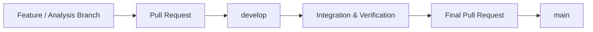

# Opening Balance Management

> A focused Blazor technical assessment for managing opening inventory balances.


## Overview

**Opening Balance Management** is a Blazor-based inventory feature developed as part of a software engineering technical assessment.

The feature is intended to help inventory users record opening stock quantities by organizing each opening balance into:

* Document Header
* Inventory Details
* Product
* Warehouse
* Quantity
* Price
* Expiry Date when applicable

The assessment specifies **Mock Data / in-memory storage** and does not require a real database at this stage.

---

## Scope

### In Scope

* Opening balance screen
* Header data entry
* Adding inventory details
* Product selection
* Warehouse selection
* Details table
* Editing details
* Deleting details
* Temporary in-memory data handling
* Validation
* Arabic RTL interface
* Responsive UI

### Out of Scope

* Real database integration
* Purchasing and sales operations
* Actual inventory posting
* Full user management and authorization
* Features outside the provided assessment

The scope follows the assessment definition.

---

## Requirements at a Glance

| Area                        | Coverage        |
| --------------------------- | --------------- |
| Functional Requirements     | FR-01 → FR-09   |
| Non-Functional Requirements | NFR-01 → NFR-06 |
| Business Rules              | BR-01 → BR-06   |
| Use Cases                   | UC-001 → UC-009 |

## The assessment defines the functional requirements, business rules, use cases, and traceability needed for the feature.

## Development Workflow



### Branches

* `main` — stable final delivery
* `develop` — integration branch
* `feature/*` — feature development
* `analysis/*` — analysis documentation when needed
* `test/*` — test-related work when needed

---

## Development Phases

```text
Setup
  ↓
Analysis
  ↓
Analysis Review
  ↓
Design
  ↓
Design Review
  ↓
Implementation
  ↓
Code Review
  ↓
Testing
  ↓
Final QA
```

### Current Phase

**Project Setup / Analysis**

---

## Documentation

Detailed project documentation will be organized by development phase:

```text
docs/
├── analysis/
├── design/
└── testing/
```

### Analysis

Requirements, business rules, use cases, acceptance criteria, traceability, and analysis decisions.

### Design

Architecture, UI structure, components, models, services, and design decisions.

### Testing

Test scenarios, validation cases, and final QA results.

---

## Solution Principles

The implementation will prioritize:

* Alignment with the provided assessment
* Clear separation of responsibilities
* Simple and maintainable architecture
* User-friendly Arabic RTL UI
* In-memory Mock Data
* Validation of business rules
* No unnecessary infrastructure or over-engineering

The assessment specifically requires Arabic RTL support, responsive UI, clear validation, and in-memory Mock Data.

---

## Team Collaboration

Development is performed collaboratively by two team members using:

**Issues → Branches → Pull Requests → Code Review → `develop` → `main`**

Each meaningful change should be reviewed before integration.

---

## Project Status

> **In Progress — Project Setup**

The repository structure and development workflow are being established before implementation begins.

---

## Assessment Reference

This repository is based on the technical assessment provided for the **Opening Balance Management** feature.

The implementation will remain within the defined assessment scope.

---

<p align="center">
  <sub>Opening Balance Management · Technical Assessment</sub>
</p>
