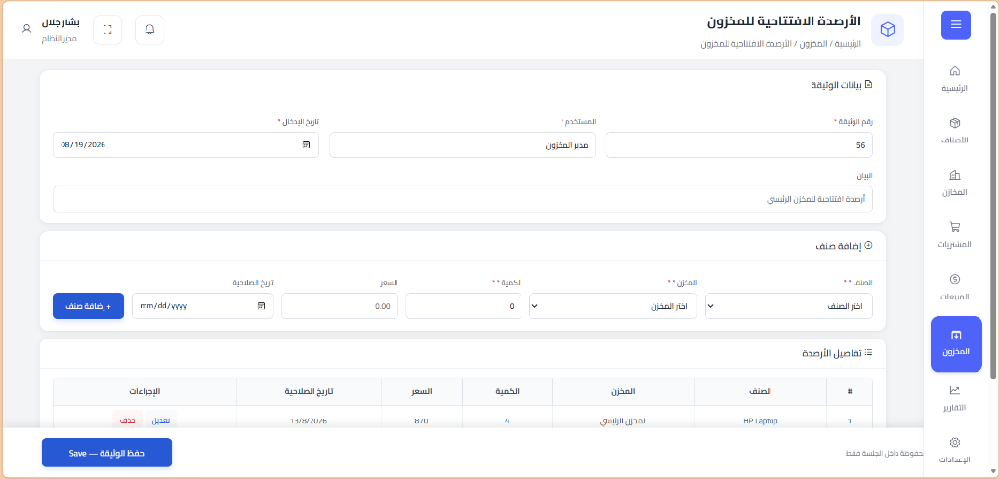
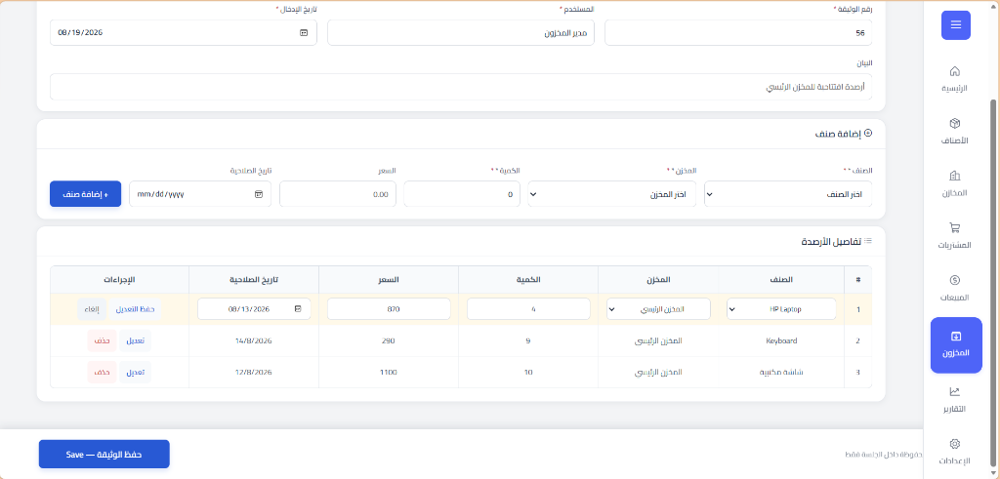
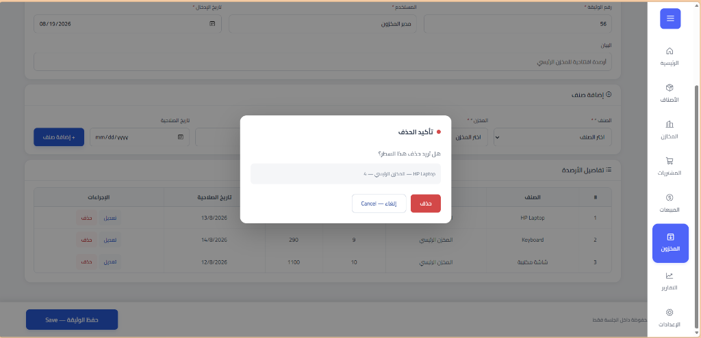
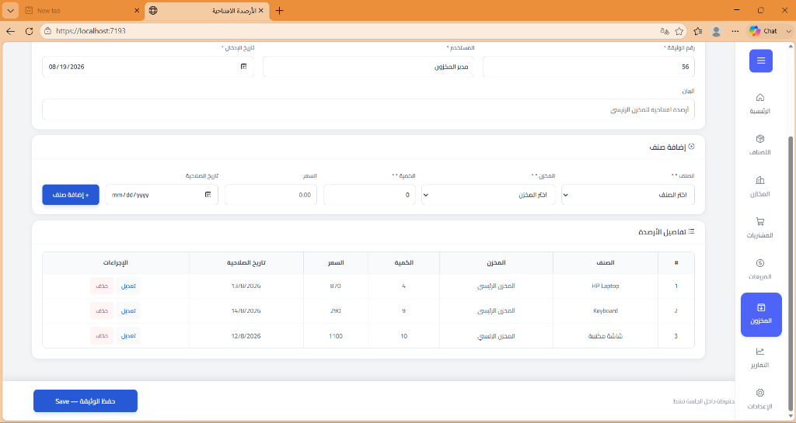
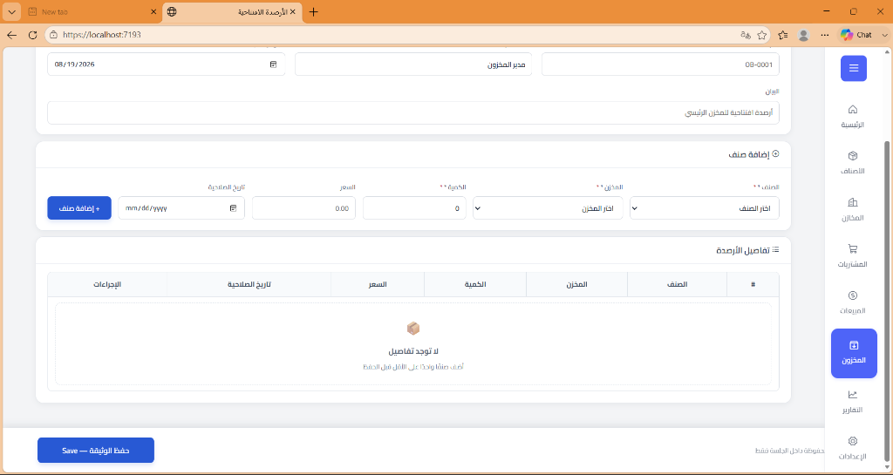
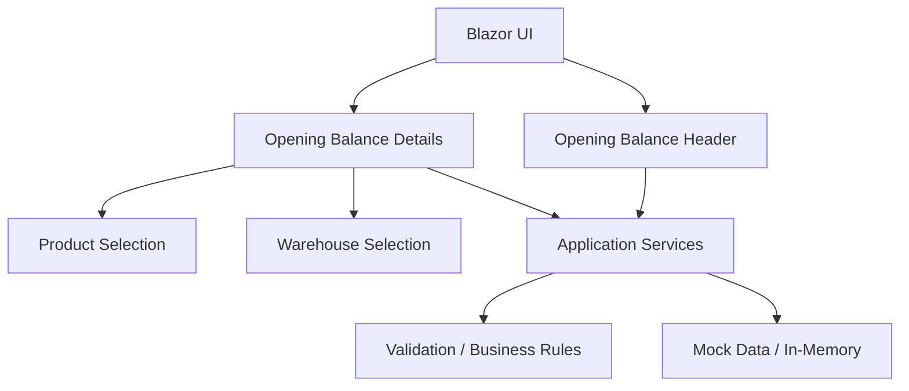
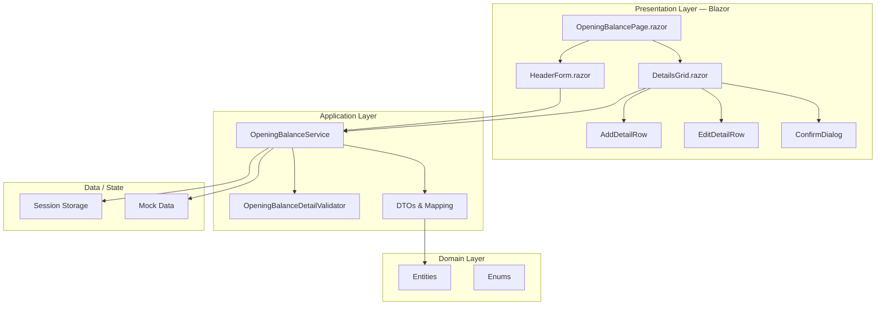
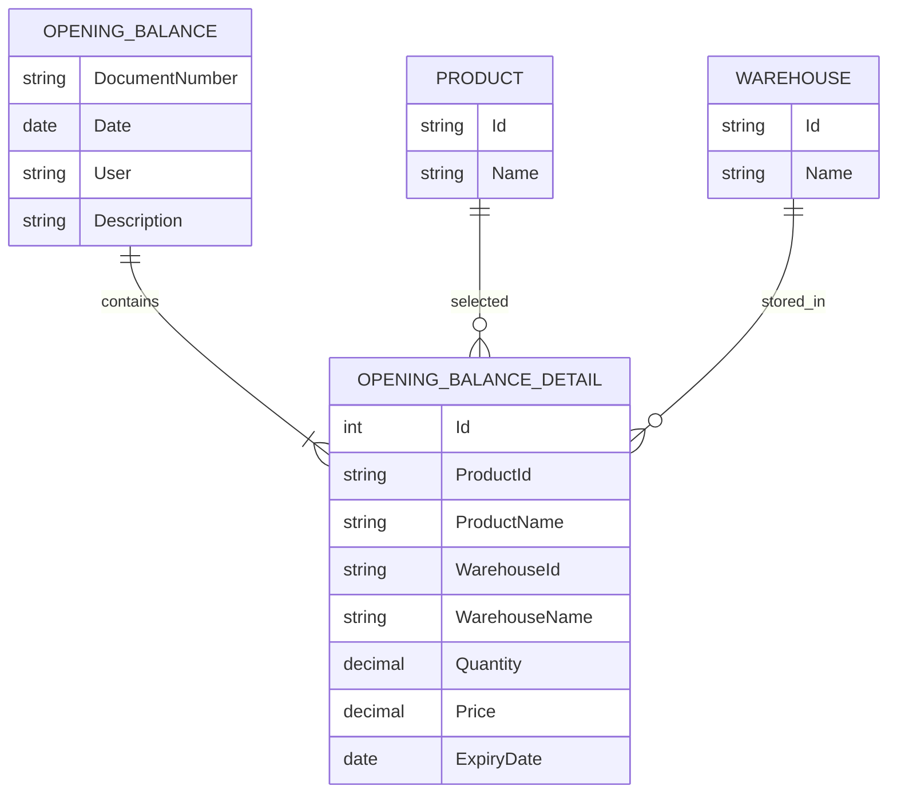
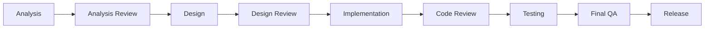
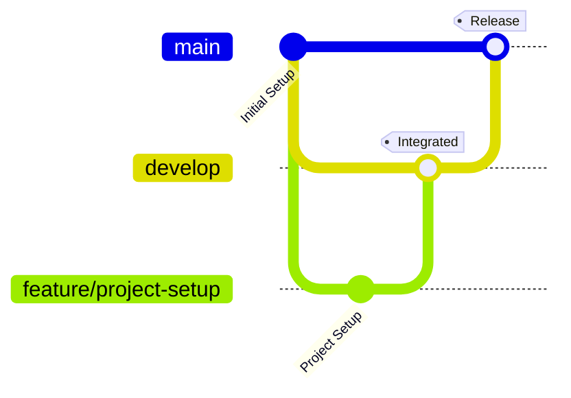

# Opening Balance Management

> A focused Blazor technical assessment for managing opening inventory balances.

---

## Overview

**Opening Balance Management** is a Blazor-based inventory feature designed to record opening stock quantities at the beginning of system usage.

The feature organizes the opening balance into two main sections:

- **Document Header**
- **Opening Balance Details**

Each detail can be associated with a product and warehouse, with quantity, price, and expiry date when applicable.

The assessment uses **Mock Data / in-memory storage** and does not require a real database at this stage.

---

## Screenshots

### Opening Balance Screen — Adding an Item

The main screen showing the document header, item addition form, and details table with one item added.



---

### Inline Edit Mode

When the user clicks "تعديل" (Edit), the row switches to inline editing mode with editable fields and save/cancel actions.



---

### Delete Confirmation Dialog

A confirmation modal appears before deleting an item, showing item details (product name, warehouse, quantity) for user verification.



---

### Details View with Multiple Items

The details table displaying three opening balance items with product, warehouse, quantity, price, and expiry date. Each row has edit and delete actions.



---

### Empty State — New Document

When creating a new document with no details added yet, an empty state message prompts the user to add at least one item before saving.



---

## Business Context

The feature is intended to help inventory users register and review the quantities available in warehouses when the inventory system is initially introduced or initialized.

### Target Users

- Inventory Staff
- System Administrator

### User Interface

- Arabic language
- RTL layout
- Responsive design

---

## Scope

### In Scope

- Open the opening balance screen
- Enter opening balance header data
- Add opening balance details
- Select products
- Select warehouses
- Enter quantity
- Enter price when applicable
- Enter expiry date when applicable
- Display opening balance details
- Edit details
- Delete details with confirmation
- Save data temporarily using Mock Data / in-memory storage
- Validate required input and business rules
- Arabic RTL interface
- Responsive user interface

### Out of Scope

- Real database integration
- Purchasing operations
- Sales operations
- Actual inventory posting or stock updates
- Full user management
- Full authorization and permission management
- Any functionality outside the provided assessment

---

## Requirements at a Glance

| Category | Coverage |
|---|---|
| Functional Requirements | FR-01 → FR-09 |
| Non-Functional Requirements | NFR-01 → NFR-06 |
| Business Rules | BR-01 → BR-06 |
| Use Cases | UC-001 → UC-009 |

### Functional Requirements

| ID | Requirement |
|---|---|
| FR-01 | Display opening balance screen |
| FR-02 | Enter opening balance header |
| FR-03 | Add opening balance details |
| FR-04 | Select product |
| FR-05 | Select warehouse |
| FR-06 | Display opening balance details |
| FR-07 | Edit item details |
| FR-08 | Delete item details |
| FR-09 | Save opening balance data |

---

## Business Rules

| ID | Rule |
|---|---|
| BR-01 | A detail cannot be added without product, warehouse, and quantity |
| BR-02 | Quantity must be greater than zero |
| BR-03 | A product may be repeated when price or expiry date differs |
| BR-04 | Warehouse selection is required |
| BR-05 | Product selection is required |
| BR-06 | Internal IDs are kept internally and descriptive names are shown to the user |

### Quantity Validation

```text
Quantity = 0    → Invalid
Quantity < 0    → Invalid
Quantity > 0    → Valid
```

---

## Use Cases

| ID | Use Case |
|---|---|
| UC-001 | Open Opening Balance Screen |
| UC-002 | Enter Opening Balance Header |
| UC-003 | Add Item to Opening Balance |
| UC-004 | Select Product |
| UC-005 | Select Warehouse |
| UC-006 | Display Opening Balance Details |
| UC-007 | Edit Opening Balance Data |
| UC-008 | Delete Opening Balance Data |
| UC-009 | Save Opening Balance Data |

---

## Solution Overview



---

## Architecture

The project follows a **Clean / Layered Architecture** adapted for a Blazor MVP:



### Layer Responsibilities

| Layer | Responsibility |
|---|---|
| **Presentation (Blazor UI)** | User interface, RTL layout, user interaction, validation messages |
| **Application Services** | Use case orchestration, validation coordination, DTO mapping |
| **Domain** | Entities, business rules, enums |
| **Data / State** | Session-scoped storage, mock data for products and warehouses |

---

## Data Model



---

## Repository Structure

```text
opening-balance-management/
│
├── README.md
│
├── docs/
│   ├── design/
│   │   ├── 01-component-and-layered-architecture.md
│   │   ├── 02-component-ui-structure(1).md
│   │   ├── 03-domain-er-model(4).md
│   │   ├── 04-sequence-add-detail.md
│   │   ├── 05-activity-main-user-flow.md
│   │   ├── 06-sequence-save-opening-balance (1).md
│   │   └── 07-state-session-flow.md
│   └── screenshots/
│       ├── 01-opening-balance-add-item.png
│       ├── 02-opening-balance-edit-item.png
│       ├── 03-opening-balance-delete-confirmation.png
│       ├── 04-opening-balance-details-view.png
│       └── 05-opening-balance-empty-state.png
│
├── src/
│   ├── OpeningBalance.Application/
│   │   ├── OpeningBalance.Application.csproj
│   │   └── Inventory/
│   │       ├── DTOs/
│   │       │   └── OpeningBalanceDetailDto.cs
│   │       ├── Interfaces/
│   │       │   ├── IOpeningBalanceService.cs
│   │       │   └── ISessionStorageService.cs
│   │       ├── Mapping/
│   │       │   └── OpeningBalanceMappingExtensions.cs
│   │       ├── Services/
│   │       │   └── OpeningBalanceService.cs
│   │       └── Validators/
│   │           └── OpeningBalanceDetailValidator.cs
│   │
│   └── OpeningBalance.Domain/
│       ├── OpeningBalance.Domain.csproj
│       └── Inventory/
│           ├── Entities/
│           │   ├── OpeningBalance.cs
│           │   ├── OpeningBalanceDetail.cs
│           │   ├── Product.cs
│           │   └── Warehouse.cs
│           └── Enums/
│               └── ValidationError.cs
│
├── tests/
│
└── .gitignore
```

---

## Source Code Overview

### Domain Layer — `OpeningBalance.Domain`

The domain layer contains the core entities and business enums with no external dependencies.

#### Entities

| Entity | Description | Key Properties |
|---|---|---|
| `OpeningBalance` | Document header representing one opening balance entry | `DocumentNumber`, `Date`, `User`, `Description`, `Details` |
| `OpeningBalanceDetail` | Individual line item within an opening balance | `Id`, `ProductId`, `ProductName`, `WarehouseId`, `WarehouseName`, `Quantity`, `Price`, `ExpiryDate` |
| `Product` | Product reference data (mock) | `Id`, `Name` |
| `Warehouse` | Warehouse reference data (mock) | `Id`, `Name` |

#### Enums

| Enum | Values |
|---|---|
| `ValidationError` | `None`, `ProductRequired`, `WarehouseRequired`, `QuantityMustBeGreaterThanZero` |

---

### Application Layer — `OpeningBalance.Application`

The application layer orchestrates use cases and bridges the domain with the presentation.

#### Service Interface — `IOpeningBalanceService`

| Method | Purpose |
|---|---|
| `GetProducts()` | Returns list of available products (mock data) |
| `GetWarehouses()` | Returns list of available warehouses (mock data) |
| `AddDetail()` | Adds a new detail line to the current document |
| `UpdateDetail()` | Updates an existing detail line |
| `RemoveDetail()` | Removes a detail line from the current document |
| `GetAllDetails()` | Returns all detail lines for the current document |
| `GetDetailById()` | Returns a specific detail line by ID |
| `ValidateDetail()` | Validates a detail line against business rules |
| `SaveOpeningBalance()` | Saves the complete document to session storage |
| `GetCurrentOpeningBalance()` | Retrieves the current document from session storage |

#### Mock Data

**Products:**

| Product |
|---|
| HP Laptop |
| Keyboard |
| شاشة مكتبية |
| ماوس لاسلكي |
| طابعة ليزر |

**Warehouses:**

| Warehouse |
|---|
| المخزن الرئيسي |
| مخزن الفرع الأول |
| مخزن الفرع الثاني |
| مخزن المواد الخام |
| مخزن المنتجات الجاهزة |

#### Document Number Generation

Document numbers are auto-generated using the format `MM-XXXX`, where `MM` is the current month and `XXXX` is an auto-incremented sequence number.

#### Validation

The `OpeningBalanceDetailValidator` validates each detail line and returns a list of `ValidationError` values:

- `ProductRequired` — when no product is selected
- `WarehouseRequired` — when no warehouse is selected
- `QuantityMustBeGreaterThanZero` — when quantity is zero or negative

#### Session Storage

The `ISessionStorageService` interface provides session-scoped key/value storage with `GetAsync<T>()` and `SetAsync<T>()` methods.

---

## UI Components

The Blazor UI follows an RTL Arabic layout with the following component hierarchy:

```text
OpeningBalancePage
├── بيانات الوثيقة (Document Header Card)
│   ├── رقم الوثيقة (Document Number) — auto-generated
│   ├── المستخدم (User) — display only
│   ├── تاريخ الإدخال (Entry Date) — date picker
│   └── البيان (Description) — text input
│
├── إضافة صنف (Add Item Card)
│   ├── الصنف (Product) — dropdown
│   ├── المخزن (Warehouse) — dropdown
│   ├── الكمية (Quantity) — numeric input
│   ├── السعر (Price) — numeric input
│   ├── تاريخ الصلاحية (Expiry Date) — date picker
│   └── + إضافة صنف (Add Item Button)
│
├── تفاصيل الأرصدة (Balance Details Table)
│   ├── # (Row Number)
│   ├── الصنف (Product Name)
│   ├── المخزن (Warehouse Name)
│   ├── الكمية (Quantity)
│   ├── السعر (Price)
│   ├── تاريخ الصلاحية (Expiry Date)
│   └── الإجراءات (Actions: Edit / Delete)
│
└── حفظ الوثيقة — Save (Save Document Button)
```

### UI States

| State | Description | Screenshot |
|---|---|---|
| **Adding Item** | Main screen with document data and one item in the table | `01-opening-balance-add-item.png` |
| **Editing Item** | Inline edit mode with editable fields and save/cancel | `02-opening-balance-edit-item.png` |
| **Delete Confirmation** | Modal dialog showing item details before deletion | `03-opening-balance-delete-confirmation.png` |
| **Multiple Items** | Table view with three items and all actions available | `04-opening-balance-details-view.png` |
| **Empty State** | New document with no details and a guidance message | `05-opening-balance-empty-state.png` |

---

## Development Workflow

This project follows a lightweight collaborative software development workflow:



---

## Git Workflow

The repository uses a simple integration-based branching strategy.



### Branches

| Branch | Purpose |
|---|---|
| `main` | Stable final delivery branch |
| `develop` | Integration and verification branch |
| `feature/*` | Feature development |
| `analysis/*` | Analysis documentation when required |
| `test/*` | Test-related work when required |

### Pull Request Flow

```text
Feature Branch
      │
      ▼
Pull Request
      │
      ▼
   develop
      │
      ▼
Integration & Testing
      │
      ▼
Final Pull Request
      │
      ▼
    main
```

### Collaboration Rules

- No direct development work on `main`
- Feature work is performed on isolated branches
- Meaningful changes are submitted through Pull Requests
- Pull Requests are reviewed by the other team member
- `develop` is used for integration and verification
- `main` represents the final stable delivery

---

## Development Phases

| Phase | Description |
|---|---|
| Setup | Project and repository preparation |
| Analysis | Requirements and business rules |
| Analysis Review | Validate and approve the analysis |
| Design | UI and technical design |
| Design Review | Review and approve the design |
| Implementation | Build the required functionality |
| Code Review | Review implementation quality |
| Testing | Verify functional and business scenarios |
| Final QA | Final requirements and usability verification |
| Release | Final stable version |

### Current Status

> **In Progress — Implementation**

---

## Documentation

Project documentation is organized by development phase.

### Analysis

`docs/analysis/`

Contains:

- Scope
- Functional Requirements
- Non-Functional Requirements
- Business Rules
- Use Cases
- Data Model
- Acceptance Criteria
- Traceability Matrix
- Analysis Decisions and Open Questions

### Design

`docs/design/`

Contains:

| Document | Topic |
|---|---|
| `01-component-and-layered-architecture.md` | System component and layered architecture diagram |
| `02-component-ui-structure(1).md` | UI component decomposition and data flows |
| `03-domain-er-model(4).md` | Domain entities, fields, relationships, and invariants |
| `04-sequence-add-detail.md` | Sequence diagram for adding items |
| `05-activity-main-user-flow.md` | Complete activity diagram for the end-to-end user journey |
| `06-sequence-save-opening-balance (1).md` | Sequence diagram for saving documents with error handling |
| `07-state-session-flow.md` | State diagram for the session draft lifecycle |

### Screenshots

`docs/screenshots/`

Contains visual reference screenshots for all major UI states:

| Screenshot | Description |
|---|---|
| `01-opening-balance-add-item.png` | Adding an item to the opening balance |
| `02-opening-balance-edit-item.png` | Inline editing of a detail row |
| `03-opening-balance-delete-confirmation.png` | Delete confirmation dialog |
| `04-opening-balance-details-view.png` | Complete details view with multiple items |
| `05-opening-balance-empty-state.png` | Empty state for a new document |

### Testing

`docs/testing/`

Contains:

- Test Scenarios
- Validation Scenarios
- Acceptance Test Checklist
- Final QA Results

---

## Analysis Traceability

The project maintains traceability from requirements to implementation and testing:

```text
Requirement
     ↓
Use Case
     ↓
Design
     ↓
Implementation
     ↓
Test
```

### Requirements to Design Mapping

| Requirement | Use Case | Design Component |
|---|---|---|
| FR-01 | UC-001 | `OpeningBalancePage` |
| FR-02 | UC-002 | `HeaderForm` |
| FR-03 | UC-003 | `AddDetailRow` + `OpeningBalanceService` |
| FR-04 | UC-004 | `ProductDropdown` |
| FR-05 | UC-005 | `WarehouseDropdown` |
| FR-06 | UC-006 | `DetailsGrid` |
| FR-07 | UC-007 | `EditDetailRow` |
| FR-08 | UC-008 | `ConfirmDialog` + `DeleteDetail` |
| FR-09 | UC-009 | `SaveDocument` + `Session` |

---

## Technology

- ASP.NET Core
- Blazor
- C#
- .NET 9.0
- Mock Data / In-Memory Data

The implementation will use only the technology and infrastructure required for the assessment scope.

---

## Design Principles

The solution prioritizes:

- Requirements alignment
- Simplicity
- Maintainability
- Clear separation of responsibilities
- Reusable components
- Validation of business rules
- Arabic RTL support
- Responsive UI
- No unnecessary infrastructure
- No over-engineering

---

## Important Decisions

Some implementation decisions are intentionally recorded during the analysis phase.

Examples include:

- Document number generation versus manual entry
- User information handling using Mock Data
- Meaning of the Save operation within an in-memory application
- Exact deletion scope where the assessment wording requires clarification

Detailed decisions are documented in:

`docs/analysis/decisions.md`

---

## Known Limitations

- No real database
- No permanent persistence
- No real authentication
- No full authorization system
- No real inventory posting
- No purchasing or sales integration
- Mock Data / in-memory storage only

These limitations follow the scope of the technical assessment.

---

## Testing Strategy

Testing will cover:

- Functional requirements
- Business rules
- Validation
- Add / Edit / Delete scenarios
- Product selection
- Warehouse selection
- Empty and invalid states
- Arabic RTL behavior
- Responsive behavior
- Acceptance criteria

---

## Team Collaboration

This project is developed collaboratively by two team members.

The team follows:

```text
Issue
  ↓
Branch
  ↓
Commit
  ↓
Pull Request
  ↓
Code Review
  ↓
develop
  ↓
Testing
  ↓
main
```

---

## Assessment Reference

This repository implements the **Opening Balance Management** technical assessment provided to the team.

The implementation remains within the defined assessment scope and uses Mock Data / in-memory storage as specified.

---

<p align="center">
  Opening Balance Management
  <br>
  <sub>Blazor Technical Assessment · Collaborative Software Development</sub>
</p>
