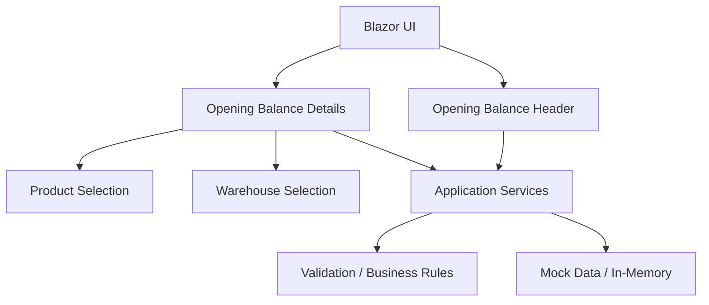
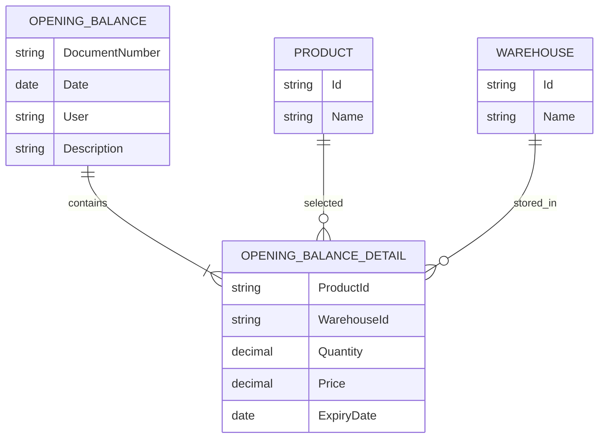
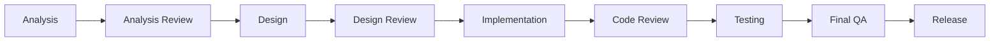
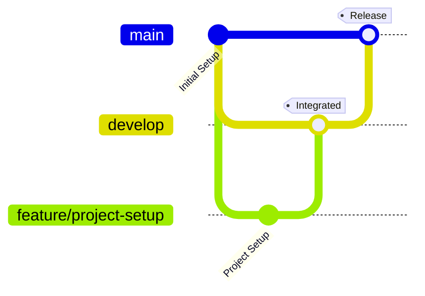

# Opening Balance Management

> A focused Blazor technical assessment for managing opening inventory balances.

---

## Overview

**Opening Balance Management** is a Blazor-based inventory feature designed to record opening stock quantities at the beginning of system usage.

The feature organizes the opening balance into two main sections:

- **Document Header**
- **Opening Balance Details**

Each detail can be associated with a product and warehouse, with quantity, price, and expiry date when applicable.

The assessment uses **Mock Data / in-memory storage** and does not require a real database at this stage.

---

## Business Context

The feature is intended to help inventory users register and review the quantities available in warehouses when the inventory system is initially introduced or initialized.

### Target Users

- Inventory Staff
- System Administrator

### User Interface

- Arabic language
- RTL layout
- Responsive design

---

## Scope

### In Scope

- Open the opening balance screen
- Enter opening balance header data
- Add opening balance details
- Select products
- Select warehouses
- Enter quantity
- Enter price when applicable
- Enter expiry date when applicable
- Display opening balance details
- Edit details
- Delete details with confirmation
- Save data temporarily using Mock Data / in-memory storage
- Validate required input and business rules
- Arabic RTL interface
- Responsive user interface

### Out of Scope

- Real database integration
- Purchasing operations
- Sales operations
- Actual inventory posting or stock updates
- Full user management
- Full authorization and permission management
- Any functionality outside the provided assessment

---

## Requirements at a Glance

| Category | Coverage |
|---|---|
| Functional Requirements | FR-01 → FR-09 |
| Non-Functional Requirements | NFR-01 → NFR-06 |
| Business Rules | BR-01 → BR-06 |
| Use Cases | UC-001 → UC-009 |

### Functional Requirements

| ID | Requirement |
|---|---|
| FR-01 | Display opening balance screen |
| FR-02 | Enter opening balance header |
| FR-03 | Add opening balance details |
| FR-04 | Select product |
| FR-05 | Select warehouse |
| FR-06 | Display opening balance details |
| FR-07 | Edit item details |
| FR-08 | Delete item details |
| FR-09 | Save opening balance data |

---

## Business Rules

| ID | Rule |
|---|---|
| BR-01 | A detail cannot be added without product, warehouse, and quantity |
| BR-02 | Quantity must be greater than zero |
| BR-03 | A product may be repeated when price or expiry date differs |
| BR-04 | Warehouse selection is required |
| BR-05 | Product selection is required |
| BR-06 | Internal IDs are kept internally and descriptive names are shown to the user |

### Quantity Validation

```text
Quantity = 0    → Invalid
Quantity < 0    → Invalid
Quantity > 0    → Valid
```

---

## Use Cases

| ID | Use Case |
|---|---|
| UC-001 | Open Opening Balance Screen |
| UC-002 | Enter Opening Balance Header |
| UC-003 | Add Item to Opening Balance |
| UC-004 | Select Product |
| UC-005 | Select Warehouse |
| UC-006 | Display Opening Balance Details |
| UC-007 | Edit Opening Balance Data |
| UC-008 | Delete Opening Balance Data |
| UC-009 | Save Opening Balance Data |

---

## Solution Overview



---

## Data Model



---

## Development Workflow

This project follows a lightweight collaborative software development workflow:



---

## Git Workflow

The repository uses a simple integration-based branching strategy.



### Branches

| Branch | Purpose |
|---|---|
| `main` | Stable final delivery branch |
| `develop` | Integration and verification branch |
| `feature/*` | Feature development |
| `analysis/*` | Analysis documentation when required |
| `test/*` | Test-related work when required |

### Pull Request Flow

```text
Feature Branch
      │
      ▼
Pull Request
      │
      ▼
   develop
      │
      ▼
Integration & Testing
      │
      ▼
Final Pull Request
      │
      ▼
    main
```

### Collaboration Rules

- No direct development work on `main`
- Feature work is performed on isolated branches
- Meaningful changes are submitted through Pull Requests
- Pull Requests are reviewed by the other team member
- `develop` is used for integration and verification
- `main` represents the final stable delivery

---

## Development Phases

| Phase | Description |
|---|---|
| Setup | Project and repository preparation |
| Analysis | Requirements and business rules |
| Analysis Review | Validate and approve the analysis |
| Design | UI and technical design |
| Design Review | Review and approve the design |
| Implementation | Build the required functionality |
| Code Review | Review implementation quality |
| Testing | Verify functional and business scenarios |
| Final QA | Final requirements and usability verification |
| Release | Final stable version |

### Current Status

> **In Progress — Project Setup / Analysis**

---

## Repository Structure

```text
opening-balance-management/
│
├── README.md
│
├── docs/
│   ├── analysis/
│   ├── design/
│   └── testing/
│
├── src/
│
├── tests/
│
└── .github/
    ├── workflows/
    └── pull_request_template.md
```

---

## Documentation

Project documentation is organized by development phase.

### Analysis

`docs/analysis/`

Contains:

- Scope
- Functional Requirements
- Non-Functional Requirements
- Business Rules
- Use Cases
- Data Model
- Acceptance Criteria
- Traceability Matrix
- Analysis Decisions and Open Questions

### Design

`docs/design/`

Contains:

- Architecture
- UI Design
- Component Design
- Model Design
- Service Responsibilities
- Validation Approach
- Design Decisions

### Testing

`docs/testing/`

Contains:

- Test Scenarios
- Validation Scenarios
- Acceptance Test Checklist
- Final QA Results

---

## Analysis Traceability

The project maintains traceability from requirements to implementation and testing:

```text
Requirement
     ↓
Use Case
     ↓
Design
     ↓
Implementation
     ↓
Test
```

This allows each important requirement to be tracked through the development lifecycle.

---

## Technology

- ASP.NET Core
- Blazor
- C#
- Mock Data / In-Memory Data

The implementation will use only the technology and infrastructure required for the assessment scope.

---

## Design Principles

The solution prioritizes:

- Requirements alignment
- Simplicity
- Maintainability
- Clear separation of responsibilities
- Reusable components
- Validation of business rules
- Arabic RTL support
- Responsive UI
- No unnecessary infrastructure
- No over-engineering

---

## Important Decisions

Some implementation decisions are intentionally recorded during the analysis phase.

Examples include:

- Document number generation versus manual entry
- User information handling using Mock Data
- Meaning of the Save operation within an in-memory application
- Exact deletion scope where the assessment wording requires clarification

Detailed decisions are documented in:

`docs/analysis/decisions.md`

---

## Known Limitations

- No real database
- No permanent persistence
- No real authentication
- No full authorization system
- No real inventory posting
- No purchasing or sales integration
- Mock Data / in-memory storage only

These limitations follow the scope of the technical assessment.

---

## Testing Strategy

Testing will cover:

- Functional requirements
- Business rules
- Validation
- Add / Edit / Delete scenarios
- Product selection
- Warehouse selection
- Empty and invalid states
- Arabic RTL behavior
- Responsive behavior
- Acceptance criteria

---

## Team Collaboration

This project is developed collaboratively by two team members.

The team follows:

```text
Issue
  ↓
Branch
  ↓
Commit
  ↓
Pull Request
  ↓
Code Review
  ↓
develop
  ↓
Testing
  ↓
main
```

---

## Assessment Reference

This repository implements the **Opening Balance Management** technical assessment provided to the team.

The implementation remains within the defined assessment scope and uses Mock Data / in-memory storage as specified.

---

<p align="center">
  Opening Balance Management
  <br>
  <sub>Blazor Technical Assessment · Collaborative Software Development</sub>
</p>
