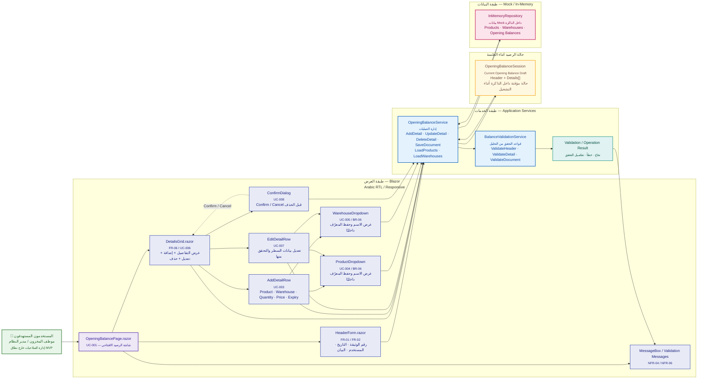

# مخطط المعمارية الطبقية ومكونات النظام

> **Component & Layered Architecture Diagram**  
> يوضح هذا المخطط العلاقة بين المستخدم، طبقة العرض في Blazor، خدمات التطبيق، حالة الرصيد الافتتاحي المؤقتة، وطبقة البيانات Mock / In-Memory ضمن نطاق الـMVP.

---

## 1. المخطط المعماري



---

## 2. كيف نقرأ المخطط؟

### المستخدم

يمثل المخطط المستخدمين المذكورين في التحليل:

- موظف المخزون.
- مدير النظام.

أما إدارة المستخدمين والصلاحيات الكاملة فهي خارج نطاق الـMVP.

---

### طبقة العرض — Blazor

هذه الطبقة مسؤولة عن واجهة المستخدم والتفاعل معها:

```text
OpeningBalancePage
├── HeaderForm
├── DetailsGrid
│   ├── AddDetailRow
│   ├── EditDetailRow
│   ├── ProductDropdown
│   ├── WarehouseDropdown
│   └── ConfirmDialog
└── MessageBox / Validation Messages
```

الهدف هنا أن تبقى تفاصيل التفاعل والـUI داخل مكونات Blazor، بينما تبقى قواعد العمل والعمليات في طبقة الخدمات.

---

### HeaderForm

يمثل رأس وثيقة الرصيد الافتتاحي:

- رقم الوثيقة.
- التاريخ.
- المستخدم.
- البيان أو الملاحظات.

**ملاحظة تصميمية:** لا يتم اعتبار رقم الوثيقة فريدًا تلقائيًا في التصميم، لأن التحليل يذكر منع التكرار فقط كمسار بديل مشروط بتطبيق هذه القاعدة.

---

### DetailsGrid

يمثل جدول تفاصيل الرصيد ويغطي:

- Product.
- Warehouse.
- Quantity.
- Price.
- Expiry Date.
- Add.
- Edit.
- Delete.

ويتم تنفيذ تأكيد الحذف من خلال `ConfirmDialog`.

---

### ProductDropdown / WarehouseDropdown

بيانات المنتجات والمخازن تأتي من Mock Data.

المستخدم يرى الاسم الوصفي، بينما يحتفظ التطبيق بالمعرّف الداخلي.

هذا يطابق قاعدة التصميم التي تمنع إظهار الـIDs للمستخدم.

---

### OpeningBalanceService

هذه الخدمة تمثل منسق العمليات الخاصة بالرصيد الافتتاحي، مثل:

```text
AddDetail
UpdateDetail
DeleteDetail
SaveDocument
LoadProducts
LoadWarehouses
```

ولا تحتوي على تفاصيل عرض الواجهة.

---

### BalanceValidationService

مسؤول عن تطبيق قواعد التحقق الموجودة في التحليل، مثل:

```text
Product is required
Warehouse is required
Quantity > 0
Document/Header validation
Document validation before Save
```

الخدمة تعيد **نتيجة تحقق**، بينما طبقة Blazor تعرض الرسالة المناسبة للمستخدم.

---

### OpeningBalanceSession

يمثل حالة وثيقة الرصيد الحالية أثناء جلسة التطبيق:

```text
OpeningBalanceSession
├── Header
└── Details[]
```

وجود هذا العنصر هو **قرار تصميمي** لتمثيل الاحتفاظ المؤقت بالبيانات داخل الذاكرة أثناء إدخال الوثيقة وتعديلها قبل الحفظ.

لا يعني ذلك وجود Database أو Persistence دائم.

---

### InMemoryRepository

تمثل طبقة البيانات المؤقتة:

```text
Products
Warehouses
Opening Balances
```

وتستخدم Mock / In-Memory Data فقط.

لا توجد قاعدة بيانات حقيقية ضمن نطاق هذا الـMVP.

---

## 3. تدفق البيانات الرئيسي

```text
User
  ↓
OpeningBalancePage
  ↓
Header / Details
  ↓
OpeningBalanceService
  ↓
BalanceValidationService
  ↓
Validation Result
  ↓
Blazor UI
```

وفي حالة البيانات:

```text
OpeningBalanceService
        ↓
OpeningBalanceSession
        ↓
InMemoryRepository
```

---

## 4. مسؤولية كل طبقة

| الطبقة | المسؤولية |
|---|---|
| Blazor UI | العرض والتفاعل وRTL ورسائل المستخدم |
| OpeningBalanceService | تنسيق عمليات الرصيد الافتتاحي |
| BalanceValidationService | تطبيق قواعد التحقق |
| OpeningBalanceSession | الاحتفاظ المؤقت بالرأس والتفاصيل أثناء التشغيل |
| InMemoryRepository | توفير Mock / In-Memory Data |
| User | تنفيذ العمليات الوظيفية المطلوبة |

---

## 5. ما هو داخل نطاق التصميم؟

هذا المخطط مصمم ليغطي الـMVP فقط:

- فتح الشاشة.
- إدخال Header.
- اختيار Product.
- اختيار Warehouse.
- إضافة Detail.
- تعديل Detail.
- حذف Detail مع التأكيد.
- التحقق من البيانات.
- حفظ البيانات داخل الذاكرة.
- عرض رسائل النجاح والخطأ.
- دعم العربية وRTL.

---

## 6. ما هو خارج نطاق هذا المخطط؟

لا يتضمن التصميم الحالي:

- قاعدة بيانات حقيقية.
- API.
- Microservices.
- Authentication System.
- Authorization System كامل.
- Inventory Posting.
- Purchasing / Sales.
- Cloud / Deployment Architecture.

هذه العناصر ليست جزءًا من نطاق الـMVP الحالي.

---

## 7. علاقة المخطط بالتحليل

| التحليل | التغطية في التصميم |
|---|---|
| FR-01 / UC-001 | `OpeningBalancePage` |
| FR-02 / UC-002 | `HeaderForm` |
| FR-03 / UC-003 | `AddDetailRow` + `OpeningBalanceService` |
| FR-04 / UC-004 | `ProductDropdown` |
| FR-05 / UC-005 | `WarehouseDropdown` |
| FR-06 / UC-006 | `DetailsGrid` |
| FR-07 / UC-007 | `EditDetailRow` |
| FR-08 / UC-008 | `ConfirmDialog` + `DeleteDetail` |
| FR-09 / UC-009 | `SaveDocument` + `OpeningBalanceSession` + `InMemoryRepository` |

---

## 8. ملاحظة تصميمية

هذا المخطط هو **Component & Layered Architecture** للمشروع.

ولا يُغني عن المخططات الأخرى في مرحلة التصميم، بل يمثل المرجع المعماري الذي يجب أن تتوافق معه لاحقًا:

1. Domain / ER Diagram
2. User Flow / Activity Diagram
3. Sequence Diagram — Add Detail
4. Sequence Diagram — Edit / Delete
5. Sequence Diagram — Save
6. UI / Component Details

> **Design Principle:** كل مخطط لاحق يجب أن يستخدم نفس أسماء المكونات والكيانات والخدمات الموجودة هنا، وأي اختلاف يجب أن يكون قرارًا تصميميًا موثقًا قبل بدء التنفيذ.
