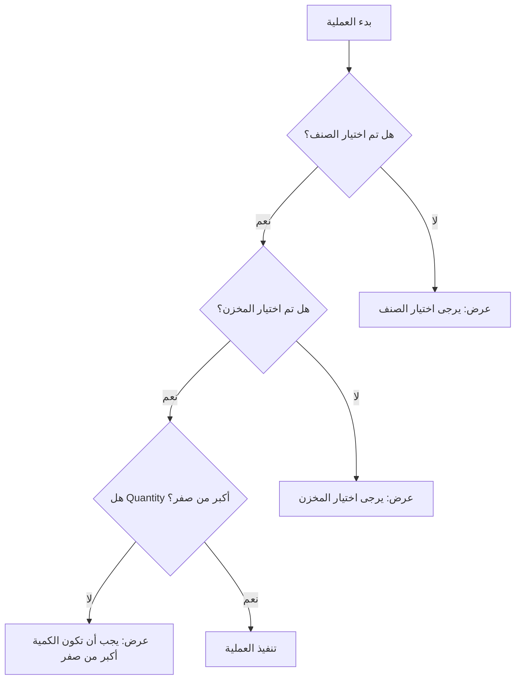
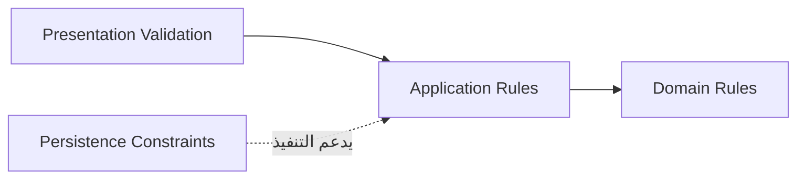

# Business Rules 


تحدد **Business Rules** القواعد التي تضبط سلوك النظام وتحافظ على صحة البيانات أثناء إدخال تفاصيل الرصيد الافتتاحي وتعديلها وحذفها وحفظها. وتمثل هذه القواعد الحدود التي يجب على النظام احترامها بغض النظر عن طريقة عرض الواجهة أو طريقة تخزين البيانات.

تساعد هذه القواعد على منع البيانات غير الصحيحة، وتوحيد سلوك العمليات، وتقديم رسائل واضحة للمستخدم عند وجود نقص أو خطأ في المدخلات.

> لا يُسمح بتنفيذ أي عملية تؤدي إلى إنشاء بيانات غير مكتملة أو غير منطقية، ويجب أن يوضح النظام سبب رفض العملية عند عدم استيفاء القاعدة.

---

## 2. جدول Business Rules

| الرمز | المتطلب | التحليل |
| --- | --- | --- |
| `BR-01` | الحقول اللازمة للإضافة | لا يمكن إضافة تفاصيل دون اختيار صنف، واختيار مخزن، وإدخال كمية. |
| `BR-02` | صحة الكمية | يجب أن تكون الكمية أكبر من صفر؛ لذلك تكون `Quantity = -5` أو `Quantity = 0` غير مقبولة. |
| `BR-03` | تكرار الصنف | يمكن تكرار الصنف إذا اختلف السعر أو تاريخ الصلاحية، مثل دواء X بكمية 50 وتاريخ 2027 ثم بكمية 30 وتاريخ 2028. |
| `BR-04` | اختيار المخزن | لا يسمح النظام بإضافة السطر أو حذفه إذا لم يتم تحديد مخزن. |
| `BR-05` | اختيار الصنف | لا يسمح النظام بإضافة السطر إذا لم يتم تحديد صنف، ويعرض رسالة توجيهية واضحة. |
| `BR-06` | المعرفات الداخلية | يحفظ النظام معرف الصنف والمخزن داخليًا، بينما يعرض للمستخدم الاسم الوصفي فقط. |

---

## 3. شرح القواعد بالتفصيل

### BR-01 — الحقول اللازمة للإضافة

لا يسمح النظام بإضافة سجل جديد إلى تفاصيل الوثيقة إلا بعد اكتمال الحقول الأساسية. وتشمل هذه الحقول اختيار الصنف، واختيار المخزن، وإدخال كمية صالحة.

| العنصر | القاعدة |
| --- | --- |
| الصنف | يجب اختيار صنف من القائمة. |
| المخزن | يجب اختيار مخزن من القائمة. |
| الكمية | يجب إدخال قيمة كمية أكبر من صفر. |
| نتيجة عدم الاكتمال | يرفض النظام الإضافة ولا يضيف صفًا ناقصًا إلى جدول `Details`. |

**مثال صحيح:** اختيار `HP Laptop`، واختيار `المخزن الرئيسي`، وإدخال كمية `50`.

**مثال غير صحيح:** اختيار الصنف وترك المخزن أو الكمية دون قيمة.

---

### BR-02 — صحة الكمية

يجب أن تكون قيمة `Quantity` أكبر من صفر. لا تمثل القيمة الصفرية أو القيمة السالبة رصيدًا افتتاحيًا صالحًا للإضافة.

| قيمة `Quantity` | النتيجة |
| --- | --- |
| `50` | مقبولة. |
| `1` | مقبولة. |
| `0` | غير مقبولة. |
| `-5` | غير مقبولة. |
| قيمة فارغة | غير مقبولة عند تنفيذ الإضافة. |

عند إدخال قيمة غير صالحة، يجب أن يمنع النظام تنفيذ العملية ويعرض رسالة واضحة مثل:

```
يجب أن تكون الكمية أكبر من صفر
```

---

### BR-03 — تكرار الصنف

لا يمنع النظام تكرار الصنف بشكل مطلق. يمكن إضافة الصنف نفسه أكثر من مرة إذا اختلف السعر أو تاريخ الصلاحية أو كانت هناك حاجة فعلية إلى تمثيل دفعتين مختلفتين.

| الصنف | الكمية | السعر | تاريخ الصلاحية | النتيجة |
| --- | --- | --- | --- | --- |
| دواء X | 50 | 100 | 2027 | مقبول كسجل أول. |
| دواء X | 30 | 100 | 2028 | مقبول كسجل ثانٍ لاختلاف تاريخ الصلاحية. |
| دواء X | 20 | 120 | 2027 | مقبول كسجل آخر لاختلاف السعر. |

لا يُعامل تكرار الاسم وحده على أنه خطأ، لأن الصنف قد يملك أكثر من دفعة أو سعر أو تاريخ صلاحية.

---

### BR-04 — اختيار المخزن

يجب تحديد المخزن قبل إضافة السطر إلى الوثيقة. كما لا يسمح النظام بحذف أو معالجة سجل لا يحتوي على مخزن صالح وفق قاعدة البيانات أو نموذج المجال.

| الحالة | سلوك النظام |
| --- | --- |
| مخزن محدد | يسمح النظام بمتابعة العملية بعد استيفاء بقية الحقول. |
| لا يوجد مخزن محدد | يرفض النظام الإضافة ويعرض رسالة توجيهية. |
| قيمة المخزن تساوي القيمة الافتراضية | تعتبر القيمة غير صالحة ولا تمثل مخزنًا فعليًا. |
| مخزن غير موجود في القائمة | يرفض النظام العملية ولا يحفظ المعرف. |

مثال على الرسالة:

```
يرجى اختيار المخزن
```

---

### BR-05 — اختيار الصنف

يجب اختيار الصنف من القائمة قبل إضافة السطر. لا يكفي أن يكون اسم الصنف مكتوبًا يدويًا إذا لم يكن مرتبطًا بمعرف داخلي صالح.

| الحالة | سلوك النظام |
| --- | --- |
| صنف محدد من القائمة | يسمح النظام بالانتقال إلى التحقق من بقية البيانات. |
| لا يوجد صنف محدد | يرفض النظام الإضافة. |
| المعرف الداخلي غير صالح | يرفض النظام العملية حتى يتم اختيار صنف صحيح. |
| اسم مكتوب دون معرف | لا يعتبر اختيارًا صالحًا. |

يجب عرض رسالة واضحة للمستخدم مثل:

```
يرجى اختيار الصنف
```

---

### BR-06 — المعرفات الداخلية

يحفظ النظام `ItemId` و`WarehouseId` داخليًا لاستخدامهما في العمليات البرمجية والتخزين المستقبلي، بينما يعرض للمستخدم `ItemName` و`WarehouseName` فقط.

| العنصر | ما يحفظه النظام | ما يعرضه للمستخدم |
| --- | --- | --- |
| الصنف | `ItemId` | اسم الصنف مثل `HP Laptop`. |
| المخزن | `WarehouseId` | اسم المخزن مثل `المخزن الرئيسي`. |
| التفاصيل | القيم الداخلية المرتبطة بالسجل | البيانات الوصفية الواضحة. |

لا ينبغي عرض معرفات النظام بدل الأسماء في القوائم أو الجداول، لأن المستخدم يتعامل مع أسماء وصفية وليس مع أرقام داخلية.

---


## 4. قواعد العمليات الأساسية

### 4.1 قاعدة الإضافة

عند الضغط على زر الإضافة، يجب أن ينفذ النظام الخطوات التالية بالترتيب:

| الترتيب | الإجراء |
| --- | --- |
| 1 | التحقق من اختيار الصنف. |
| 2 | التحقق من اختيار المخزن. |
| 3 | التحقق من أن `Quantity > 0`. |
| 4 | قراءة السعر إذا تم إدخاله. |
| 5 | قراءة تاريخ الصلاحية إذا تم إدخاله. |
| 6 | إنشاء سجل تفاصيل جديد. |
| 7 | إضافة السجل إلى جدول `Details`. |
| 8 | عرض رسالة نجاح وتفريغ نموذج الإدخال. |

إذا فشل أي تحقق، يتوقف النظام قبل إنشاء السجل.

### 4.2 قاعدة التعديل

عند تعديل سجل موجود، يجب أن يحتفظ النظام بمعرف السجل، ثم يعيد تطبيق قواعد التحقق نفسها المستخدمة عند الإضافة. لا يسمح التعديل بإنشاء سجل ناقص أو تحويل سجل صالح إلى سجل غير صالح.

### 4.3 قاعدة الحذف

يجب أن يكون الحذف عملية مقصودة وواضحة للمستخدم. عند اختيار الحذف، يعثر النظام على السجل بواسطة معرفه الداخلي، ثم يحذفه من مجموعة `Details` بعد تأكيد المستخدم، ويعرض نتيجة العملية.

| الحالة | النتيجة |
| --- | --- |
| السجل موجود | يحذف النظام السجل ويعرض رسالة نجاح. |
| السجل غير موجود | يرفض النظام العملية ويعرض رسالة خطأ. |
| المستخدم يلغي التأكيد | لا يتم حذف أي بيانات. |

### 4.4 قاعدة الحفظ

لا يعتبر حفظ الوثيقة ناجحًا إذا لم تكتمل بيانات الرأس أو لم يوجد أي سجل داخل `Details`.

| شرط الحفظ | النتيجة |
| --- | --- |
| رقم الوثيقة موجود | يمر التحقق الأولي. |
| رقم الوثيقة فارغ | يرفض النظام الحفظ. |
| يوجد صنف واحد على الأقل | يمر التحقق الخاص بالتفاصيل. |
| لا توجد تفاصيل | يرفض النظام الحفظ. |
| جميع الشروط مستوفاة | يعرض النظام رسالة نجاح. |

في المرحلة الحالية، لا يعني الحفظ الكتابة في قاعدة بيانات دائمة، بل يمثل نجاح العملية داخل نطاق `Mock Data` والذاكرة.

---

## 5. ترتيب التحقق ورسائل الخطأ

يجب تنفيذ التحققات بترتيب واضح حتى يحصل المستخدم على رسالة مفيدة بدل ظهور عدة أخطاء غير مرتبة.



---

## 6. مصفوفة تطبيق القواعد

| العملية | BR-01 | BR-02 | BR-03 | BR-04 | BR-05 | BR-06 |
| --- | --- | --- | --- | --- | --- | --- |
| إضافة تفاصيل | نعم | نعم | نعم | نعم | نعم | نعم |
| تعديل تفاصيل | نعم | نعم | نعم | نعم | نعم | نعم |
| حذف تفاصيل | جزئيًا | لا | لا | نعم | لا | نعم |
| حفظ الوثيقة | على مستوى الوثيقة | على مستوى التفاصيل | لا | نعم | نعم | نعم |
| عرض البيانات | لا | لا | لا | عرض الاسم | عرض الاسم | نعم |

---

## 7. علاقة Business Rules بالطبقات المعمارية

| نوع القاعدة | الطبقة الأنسب | سبب وضعها هناك |
| --- | --- | --- |
| قواعد الكيان الأساسية | `Domain` | لأنها تمثل صحة المفاهيم الأساسية بغض النظر عن الواجهة. |
| قواعد العملية وترتيب التنفيذ | `Application` | لأنها مرتبطة بحالات الاستخدام وتنسيق العمليات. |
| قواعد العرض ورسائل الواجهة | `Presentation` | لأنها مرتبطة بطريقة عرض التنبيه للمستخدم. |
| قواعد التخزين أو قيود قاعدة البيانات | `Infrastructure` | لأنها تعتمد على technology التخزين. |



---

## 8. معايير قبول Business Rules

| الرمز | معيار القبول |
| --- | --- |
| `BR-AC-01` | لا يمكن إضافة تفاصيل دون اختيار صنف ومخزن وإدخال كمية موجبة. |
| `BR-AC-02` | ترفض القيم `Quantity = 0` والقيم السالبة. |
| `BR-AC-03` | يسمح النظام بتكرار الصنف عند اختلاف السعر أو تاريخ الصلاحية. |
| `BR-AC-04` | يعرض النظام أسماء الأصناف والمخازن بدل المعرفات الداخلية. |
| `BR-AC-05` | تظهر رسالة واضحة عند فشل أي تحقق. |
| `BR-AC-06` | لا يؤدي إلغاء الحذف إلى إزالة السجل. |
| `BR-AC-07` | لا ينجح حفظ الوثيقة دون رقم وثيقة وتفصيل واحد على الأقل. |

---
