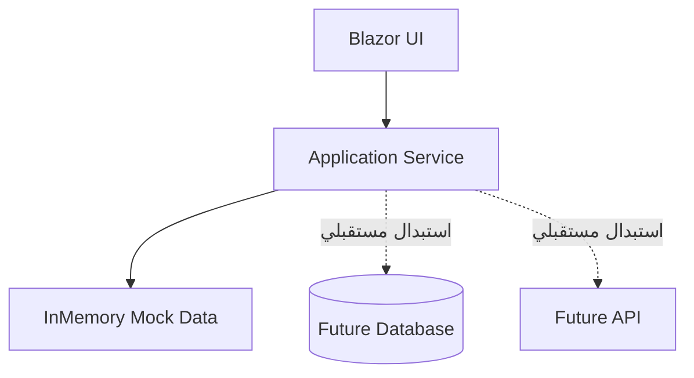
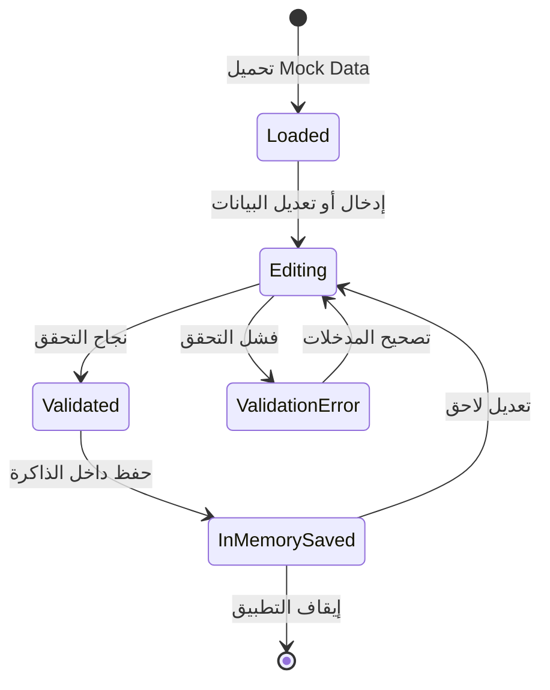
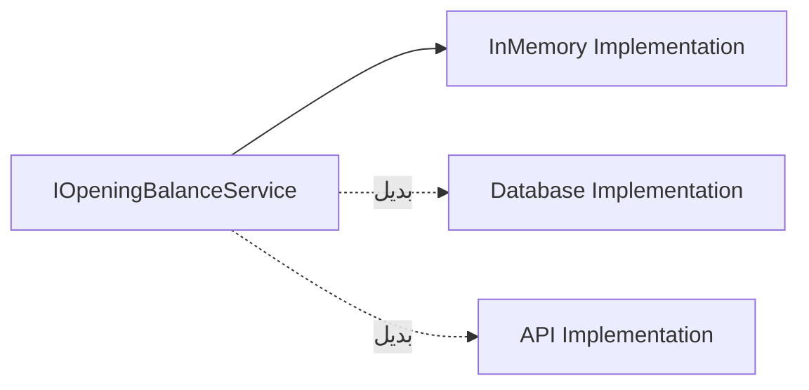
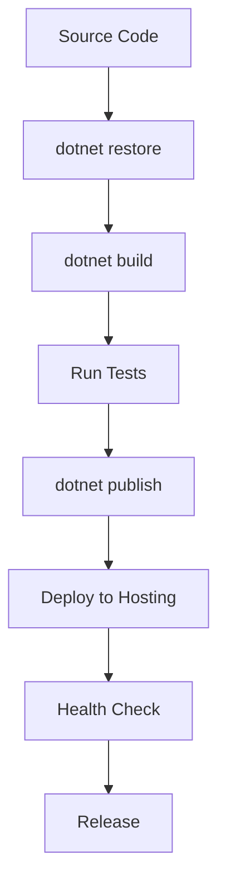

# Deployment and DataDeployment and Data

## 1. Purpose

يوضح هذا المستند طريقة تشغيل التطبيق، وإدارة البيانات، والفروق بين البيئات، وخطوات البناء والنشر، إضافة إلى خطة الانتقال من `Mock Data` إلى تخزين دائم في Database أو API.

يركز المستند على الجوانب التشغيلية التي يحتاجها المطور أو مسؤول النظام أثناء إعداد التطبيق وتشغيله وتسليمه.

## 2. Runtime Overview

يعتمد التطبيق على `Blazor Web App` مع `Interactive Server`، ويعمل فوق `ASP.NET Core` وبيئة `.NET`.

| العنصر | القيمة |
| --- | --- |
| Application Type | `Blazor Web App` |
| Interactivity | `Interactive Server` |
| Runtime | `.NET 9` |
| Language | `C#` |
| Current Data Source | `In-Memory Mock Data` |
| Persistent Database | غير مستخدمة في المرحلة الحالية |
| Default Interface Language | العربية |
| Layout Direction | `RTL` |

## 3. Environments

يجب فصل إعدادات التشغيل حسب البيئة حتى لا يتم استخدام إعدادات التطوير داخل بيئة الإنتاج.


| البيئة | الغرض | مصدر البيانات | مستوى التسجيل |
| --- | --- | --- | --- |
| `Development` | التطوير والتجارب المحلية. | `Mock Data` أو Local Database. | Detailed Logging. |
| `Staging` | اختبار النسخة قبل الإنتاج. | بيانات اختبار معزولة. | Normal Logging. |
| `Production` | الاستخدام الفعلي. | Database دائمة أو API. | Warning وError مع مراقبة. |

## 4. Development Environment

تستخدم بيئة `Development` أثناء كتابة الكود وتجربة الواجهة وقواعد العمل.

### متطلبات التشغيل

| المتطلب | الوصف |
| --- | --- |
| `.NET SDK` | الإصدار المتوافق مع المشروع. |
| IDE أو Editor | Visual Studio أو VS Code أو Rider. |
| Git | لإدارة الإصدارات والفروع. |
| Browser | متصفح حديث يدعم JavaScript وWebSocket. |
| Operating System | Windows أو Linux أو macOS. |

### أوامر التشغيل

```bash
dotnet restore
dotnet build
dotnet run
```

بعد تشغيل التطبيق، يفتح المطور الرابط المحلي الذي يظهر في شاشة التشغيل، مثل:

```
https://localhost:xxxx
http://localhost:xxxx
```

## 5. Staging Environment

تستخدم بيئة `Staging` للتأكد من أن النسخة تعمل بصورة قريبة من Production قبل تسليمها للمستخدمين.

يجب أن تكون بيانات `Staging` منفصلة عن بيانات Production، وألا تحتوي على بيانات حقيقية غير مصرح باستخدامها.

| الفحص | الهدف |
| --- | --- |
| Build Validation | التأكد من أن النسخة قابلة للبناء. |
| Functional Testing | اختبار العمليات الأساسية. |
| UI Testing | مراجعة الواجهة والاتجاه `RTL`. |
| Data Testing | التأكد من صحة القراءة والكتابة. |
| Error Testing | اختبار حالات الفشل والرسائل. |
| Performance Smoke Test | التأكد من عدم وجود تأخير واضح. |

## 6. Production Environment

تمثل بيئة `Production` البيئة التي يستخدمها المستخدمون الفعليون. يجب ألا يتم النشر إليها إلا بعد نجاح البناء والاختبارات والمراجعة.

### المتطلبات الأساسية

| المتطلب | الوصف |
| --- | --- |
| Hosting | خادم أو Cloud Platform يدعم ASP.NET Core. |
| HTTPS | تشفير الاتصال بين المستخدم والتطبيق. |
| Process Management | إعادة تشغيل التطبيق تلقائيًا عند توقفه. |
| Configuration | إعدادات Production منفصلة عن Development. |
| Logging | تسجيل الأخطاء والأحداث المهمة. |
| Monitoring | متابعة توفر التطبيق وصحته. |
| Backup | نسخ احتياطي إذا تم استخدام Database دائمة. |

## 7. Data Strategy

يستخدم التطبيق حاليًا `Mock Data` داخل الذاكرة لتسهيل التطوير واختبار الواجهة وقواعد العمل دون الحاجة إلى إعداد Database.



| العنصر | المرحلة الحالية | المرحلة المستقبلية |
| --- | --- | --- |
| الأصناف | قائمة داخل الذاكرة. | جدول أصناف أو Inventory API. |
| المخازن | قائمة داخل الذاكرة. | جدول مخازن أو Inventory API. |
| الوثائق | كائنات مؤقتة. | جدول وثائق دائم. |
| التفاصيل | قائمة مرتبطة بالوثيقة. | جدول تفاصيل مرتبط بالوثيقة. |
| الحفظ | يظل داخل نطاق التشغيل الحالي. | Persistent Storage. |
| الاسترجاع | من القيم المحملة في الذاكرة. | قراءة من Database أو API. |

## 8. Mock Data

يجب أن تكون بيانات الاختبار واضحة ومحدودة ومناسبة للعرض، وألا يتم التعامل معها على أنها بيانات حقيقية.

### أمثلة البيانات

| النوع | أمثلة |
| --- | --- |
| Items | `HP Laptop`، `Logitech Mouse`، `Keyboard`. |
| Warehouses | `المخزن الرئيسي`، `مخزن الأدوية`، `مخزن الأجهزة`. |
| Document Number | `OB-001`. |
| Quantity | `50`. |
| Unit Price | `500`. |
| Expiry Date | قيمة اختيارية حسب الصنف. |

### قواعد Mock Data

| القاعدة | الوصف |
| --- | --- |
| عدم اعتبارها بيانات إنتاج | تستخدم للاختبار فقط. |
| معرفات ثابتة | يجب أن يمتلك كل Item وWarehouse معرفًا واضحًا. |
| بيانات قابلة للاستبدال | يجب ألا تنتشر القوائم الوهمية داخل Components. |
| عزل التنفيذ | توضع داخل `Infrastructure`. |
| سهولة الاختبار | يجب أن تكون قابلة لإعادة التهيئة والاختبار. |

## 9. Data Lifecycle



في الوضع الحالي، تختفي البيانات المؤقتة عند إيقاف التطبيق أو إعادة تشغيله. لذلك يجب عدم استخدام النسخة الحالية لتخزين بيانات فعلية مهمة.

## 10. خطة الانتقال إلى Database

عند الحاجة إلى الحفظ الدائم، يتم الانتقال تدريجيًا دون تغيير الواجهة أو Business Rules قدر الإمكان.

| المرحلة | الإجراء |
| --- | --- |
| 1 | اختيار Database مناسبة. |
| 2 | إنشاء جداول `OpeningBalanceDocuments` و`OpeningBalanceDetails`. |
| 3 | إنشاء العلاقات بين الرأس والتفاصيل. |
| 4 | إنشاء Repository أو Data Access Service. |
| 5 | تطبيق `IOpeningBalanceService` باستخدام Database. |
| 6 | إضافة Migrations وInitial Data. |
| 7 | اختبار القراءة والإضافة والتعديل والحذف والحفظ. |
| 8 | نقل إعدادات الاتصال إلى Environment Variables أو Secret Store. |
| 9 | تنفيذ Backup وRecovery Plan. |
| 10 | تشغيل اختبار Staging قبل Production. |



## 11. نموذج البيانات المستقبلي

| الجدول | الغرض | أهم الحقول |
| --- | --- | --- |
| `OpeningBalanceDocuments` | تخزين رأس الوثيقة. | `Id`، `DocumentNumber`، `DocumentDate`، `UserName`، `Notes`. |
| `OpeningBalanceDetails` | تخزين تفاصيل الوثيقة. | `Id`، `DocumentId`، `ItemId`، `WarehouseId`، `Quantity`، `UnitPrice`، `ExpiryDate`. |
| `Items` | تعريف الأصناف. | `Id`، `Name`، `IsActive`. |
| `Warehouses` | تعريف المخازن. | `Id`، `Name`، `IsActive`. |

العلاقة الأساسية هي أن وثيقة واحدة يمكن أن تحتوي على عدة سجلات تفاصيل، بينما يرتبط كل سجل تفاصيل بوثيقة واحدة.

## 12. Configuration Management

يجب فصل الإعدادات عن الكود، وتغييرها حسب البيئة.

| الإعداد | Development | Staging | Production |
| --- | --- | --- | --- |
| `ASPNETCORE_ENVIRONMENT` | `Development` | `Staging` | `Production` |
| Data Provider | `InMemory` | Test Database أو Mock | Production Database أو API |
| Logging | Detailed | Normal | Warning وError |
| Error Details | ظاهرة للمطور | محدودة | غير ظاهرة للمستخدم |
| HTTPS | اختياري محليًا | مطلوب | مطلوب |

لا ينبغي حفظ كلمات المرور أو Connection Strings الحساسة داخل GitHub. تستخدم Environment Variables أو Secret Management المناسبة للبيئة.

## 13. Build and Publish

### البناء المحلي

```bash
dotnet restore
dotnet build --configuration Release
```

### النشر إلى مجلد

```bash
dotnet publish \\
  --configuration Release \\
  --output ./publish
```

يحتوي مجلد `publish` على الملفات المطلوبة لتشغيل التطبيق في بيئة الاستضافة.

### التشغيل من نسخة النشر

```bash
dotnet OpeningBalance.Web.dll
```

يجب ضبط المنفذ والبيئة من خلال إعدادات الاستضافة أو Environment Variables.

## 14. Deployment Flow



| المرحلة | شرط الانتقال |
| --- | --- |
| `Restore` | نجاح تحميل الاعتماديات. |
| `Build` | عدم وجود أخطاء Compile. |
| `Test` | نجاح الاختبارات الأساسية. |
| `Publish` | إنشاء ملفات النشر. |
| `Deploy` | رفع الملفات وتشغيل التطبيق. |
| `Health Check` | استجابة الموقع وعمل الشاشة الرئيسية. |
| `Release` | الموافقة على إتاحة النسخة للمستخدمين. |

## 15. Logging and Monitoring

يجب تسجيل الأحداث المهمة دون تسجيل بيانات حساسة أو كلمات مرور.

| الحدث | مستوى التسجيل |
| --- | --- |
| بدء التطبيق | `Information` |
| نجاح عملية رئيسية | `Information` |
| إدخال غير صحيح | `Warning` |
| فشل خدمة | `Error` |
| توقف غير متوقع | `Critical` |

يجب أن تساعد السجلات في معرفة وقت الخطأ ومكانه، دون كشف معلومات سرية للمستخدم النهائي.

## 16. Backup and Recovery

في المرحلة الحالية لا توجد Backup حقيقية لأن البيانات مؤقتة في الذاكرة. عند إضافة Database، يجب إنشاء سياسة نسخ احتياطي واضحة.

| العنصر | القرار المستقبلي |
| --- | --- |
| نوع النسخ | Full Backup مع نسخ دورية حسب الحاجة. |
| مكان التخزين | مكان منفصل وآمن عن الخادم الأساسي. |
| الاختبار | اختبار استعادة النسخة دوريًا. |
| الوصول | يقتصر على المسؤولين المخولين. |
| Recovery | توثيق خطوات إعادة تشغيل التطبيق واستعادة البيانات. |

## 17. Deployment Checklist

| الفحص | الحالة المطلوبة |
| --- | --- |
| `dotnet build --configuration Release` | ينجح دون أخطاء. |
| Configuration | مضبوطة حسب البيئة. |
| Secrets | غير موجودة داخل GitHub. |
| Data Source | معروف ومناسب للبيئة. |
| HTTPS | مفعل في Staging وProduction. |
| Logging | مفعل دون كشف بيانات حساسة. |
| Health Check | الصفحة الرئيسية تستجيب. |
| Mock Data | لا تستخدم في Production إلا بقرار واضح. |
| Rollback | توجد طريقة للعودة إلى النسخة السابقة. |
| Documentation | خطوات التشغيل والنشر محدثة. |

## 18. Current Status and Future State

| المجال | Current State | Future State |
| --- | --- | --- |
| Application | Blazor Web App يعمل بنمط Interactive Server. | استمرار النمط أو تغييره وفق احتياج المشروع. |
| Architecture | Clean Architecture. | الحفاظ على الحدود مع إضافة خدمات جديدة. |
| Data | In-Memory Mock Data. | Database أو API دائمة. |
| Authentication | غير مكتملة في المرحلة الأولية. | Authentication وAuthorization. |
| Audit | غير متوفر كـ Audit Trail دائم. | تسجيل عمليات الإضافة والتعديل والحذف. |
| Hosting | بيئة تطوير أو استضافة مؤقتة. | Hosting دائم مع Monitoring وBackup. |
