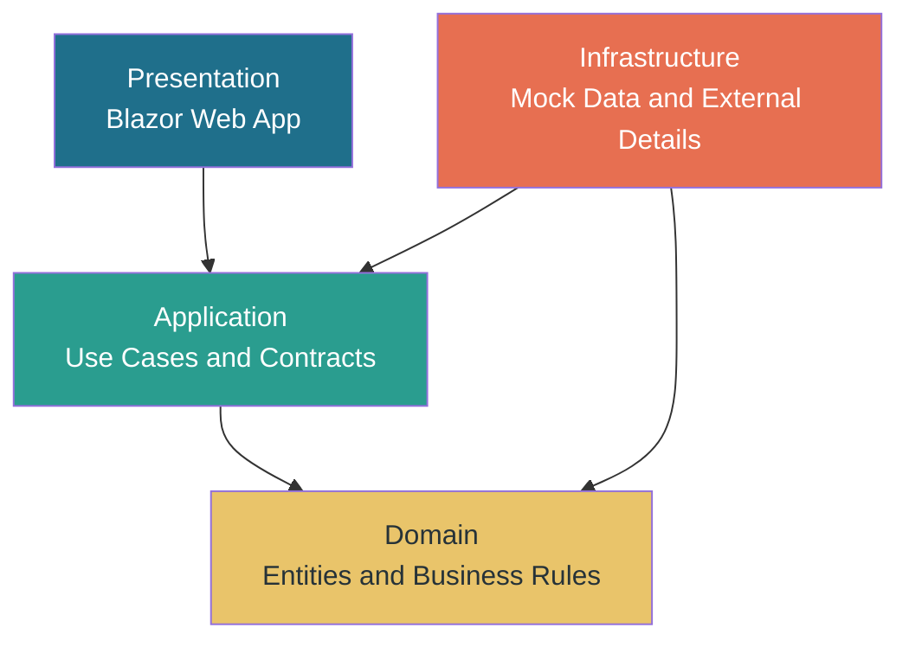
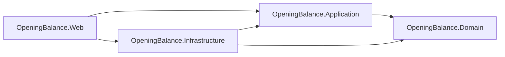
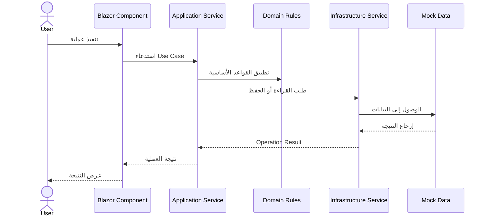

# System Architecture

## 1. Purpose

يوضح هذا المستند البنية التقنية العامة للتطبيق، ومكوناته الرئيسية، وحدود كل طبقة، واتجاه الاعتماد بينها، وتدفق الطلبات والبيانات. لا يكرر هذا المستند المتطلبات الوظيفية أو حالات الاستخدام، بل يشرح **كيف يتم بناء التطبيق وتشغيل مكوناته معًا**.

## 2. Architecture Style

يعتمد التطبيق على **Clean Architecture** داخل **Blazor Web App** باستخدام نمط **Interactive Server**. وتقسم البنية إلى طبقات واضحة، بحيث يكون منطق العمل مستقلًا عن واجهة المستخدم وتفاصيل التخزين.



## 3. Main Components

| المكون | المسؤولية الرئيسية |
| --- | --- |
| `Blazor Web App` | عرض الواجهات والتعامل مع تفاعل المستخدم. |
| `Presentation Layer` | صفحات `Razor` و`Components` و`Layouts` و`RTL`. |
| `Application Layer` | تعريف حالات الاستخدام والعقود ونتائج العمليات. |
| `Domain Layer` | تعريف الكيانات والقواعد الأساسية المستقلة عن التقنية. |
| `Infrastructure Layer` | تنفيذ الخدمات وتوفير `Mock Data` والتخزين المؤقت. |
| `Program.cs` | تكوين التطبيق وتسجيل الخدمات عبر `Dependency Injection`. |

## 4. Solution Structure

```
src/
├── OpeningBalance.Web/
│   ├── Components/
│   │   ├── App.razor
│   │   ├── Layout/
│   │   │   ├── MainLayout.razor
│   │   │   └── NavMenu.razor
│   │   └── Pages/
│   │       └── OpeningBalance.razor
│   ├── wwwroot/
│   ├── Program.cs
│   └── OpeningBalance.Web.csproj
│
├── OpeningBalance.Domain/
│   ├── Entities/
│   ├── ValueObjects/
│   ├── Rules/
│   └── OpeningBalance.Domain.csproj
│
├── OpeningBalance.Application/
│   ├── Interfaces/
│   ├── UseCases/
│   ├── DTOs/
│   ├── Validators/
│   └── OpeningBalance.Application.csproj
│
└── OpeningBalance.Infrastructure/
    ├── Services/
    ├── MockData/
    ├── Persistence/
    └── OpeningBalance.Infrastructure.csproj
```

## 5. Layer Responsibilities

| الطبقة | ما تحتويه | ما لا يجب أن تعتمد عليه |
| --- | --- | --- |
| `Domain` | `Entities` و`Value Objects` وBusiness Rules الأساسية. | Blazor، ASP.NET، Database، Infrastructure. |
| `Application` | `Use Cases` وInterfaces وDTOs وValidation. | تفاصيل الواجهة أو مزود Database محدد. |
| `Infrastructure` | تنفيذ الخدمات و`Mock Data` وRepositories والتكاملات. | منطق العرض ومكونات Blazor. |
| `Presentation` | صفحات الواجهة والتخطيط والأحداث والرسائل. | امتلاك Business Rules الأساسية بشكل مباشر. |

## 6. Dependency Direction

يجب أن يتجه الاعتماد من الطبقات الخارجية نحو الطبقات الداخلية. وتعرف الطبقة الداخلية العقود، بينما تقدم الطبقة الخارجية التنفيذ الفعلي.



| الاعتماد | الغرض |
| --- | --- |
| `Application → Domain` | استخدام الكيانات والقواعد الأساسية. |
| `Infrastructure → Application` | تنفيذ Interfaces التي تعرفها Application. |
| `Infrastructure → Domain` | التعامل مع كيانات المجال عند التخزين أو المعالجة. |
| `Web → Application` | استدعاء حالات الاستخدام من الواجهة. |
| `Web → Infrastructure` | تسجيل التنفيذ الفعلي في `Dependency Injection`. |

## 7. Application Flow



## 8. Dependency Injection

يتم تسجيل الخدمات في `Program.cs`، ثم يتم حقنها في مكونات Blazor بدل إنشاء تنفيذ الخدمة داخل الصفحة.

```csharp
builder.Services.AddScoped<IOpeningBalanceService,
    InMemoryOpeningBalanceService>();
```

| العنصر | دوره |
| --- | --- |
| `IOpeningBalanceService` | العقد الذي تتعامل معه الواجهة. |
| `InMemoryOpeningBalanceService` | التنفيذ الحالي باستخدام `Mock Data`. |
| `AddScoped` | تحديد دورة حياة الخدمة داخل التطبيق. |
| Blazor Component | استهلاك العقد دون معرفة تفاصيل التنفيذ. |

## 9. Data and Persistence

في المرحلة الحالية لا يستخدم التطبيق Database دائمة. يتم توفير البيانات من خلال `Mock Data` وتنفيذ In-Memory داخل `Infrastructure`.

| العنصر | الوضع الحالي | التوسعة المستقبلية |
| --- | --- | --- |
| الأصناف | قائمة مؤقتة في الذاكرة | جدول أو API للأصناف. |
| المخازن | قائمة مؤقتة في الذاكرة | جدول أو API للمخازن. |
| الوثائق | بيانات داخل الذاكرة | Database دائمة. |
| الحفظ | مؤقت خلال تشغيل التطبيق | Repository أو API. |
| الاستمرارية | تنتهي عند إعادة التشغيل | حفظ دائم واسترجاع لاحق. |

## 10. Architectural Boundaries

| الحد المعماري | القاعدة |
| --- | --- |
| واجهة المستخدم مع Application | تستدعي الواجهة العقود ولا تنفذ التخزين مباشرة. |
| Application مع Infrastructure | تتعامل Application مع Interfaces وليس implementations محددة. |
| Domain مع بقية الطبقات | يبقى Domain مستقلًا عن تفاصيل التطبيق. |
| Infrastructure مع Domain | ينفذ التفاصيل الخارجية دون نقلها إلى القواعد الداخلية. |
| Data مع Presentation | لا تصل البيانات الخارجية مباشرة إلى مكونات العرض دون تحويل أو خدمة. |

## 11. Non-Functional Architecture Concerns

| الجانب | القرار المعماري |
| --- | --- |
| قابلية الاختبار | فصل Business Rules عن الواجهة والتخزين. |
| قابلية التوسع | إمكانية استبدال `Mock Data` بقاعدة بيانات أو API. |
| قابلية الصيانة | وضع كل مسؤولية داخل طبقة محددة. |
| التفاعل | استخدام `Interactive Server` لتنفيذ العمليات داخل الصفحة. |
| اللغة والاتجاه | دعم `Arabic` و`RTL` على مستوى التطبيق. |
| التوافق | تشغيل التطبيق على بيئة تدعم ASP.NET Core و.NET. |

## 12. Architectural Rules for Development

| القاعدة | التطبيق العملي |
| --- | --- |
| لا تضع Business Rules داخل Component مباشرة | انقل القواعد إلى Domain أو Application. |
| لا تتصل الواجهة بقاعدة البيانات مباشرة | استخدم Service أو Repository عبر Interface. |
| لا تجعل Domain يعتمد على Framework | حافظ على Domain كمشروع مستقل. |
| لا تنشئ الخدمة يدويًا داخل الصفحة | استخدم `Dependency Injection`. |
| لا تخلط DTOs مع Entities دون سبب | استخدم نماذج نقل واضحة عند الحاجة. |
| حدّث هذا المستند عند تغيير البنية | يجب أن يعكس التوثيق الكود الفعلي. |

## 13. Architecture Validation Checklist

| الفحص | الحالة المطلوبة |
| --- | --- |
| بناء الحل | ينجح `dotnet build` دون أخطاء. |
| اتجاه الاعتماد | لا توجد مراجع عكسية غير مبررة. |
| استقلال Domain | لا يعتمد على Blazor أو Infrastructure. |
| حقن الخدمات | جميع الخدمات المسؤولة مسجلة في `Program.cs`. |
| قابلية الاستبدال | يمكن تغيير In-Memory دون تعديل الواجهة. |
| فصل العرض | لا يحتوي Component على تفاصيل تخزين مباشرة. |
| توثيق القرار | كل تغيير معماري مهم مسجل في `architecture-decisions.md`. |

## 14. Summary

تعتمد البنية على فصل واضح بين العرض، وحالات الاستخدام، وقواعد المجال، والتفاصيل الخارجية. ويجعل هذا الفصل التطبيق أكثر قابلية للاختبار والصيانة والتوسعة، كما يسمح بتغيير طريقة التخزين أو الخدمات الخارجية دون إعادة بناء منطق التطبيق بالكامل.

هذا الملف يمثل المرجع المعماري العام. أما المتطلبات وقواعد العمل وحالات الاستخدام فتظل في ملفاتها المستقلة، ويتم الربط بينها من خلال `README.md` الرئيسي للمشروع.