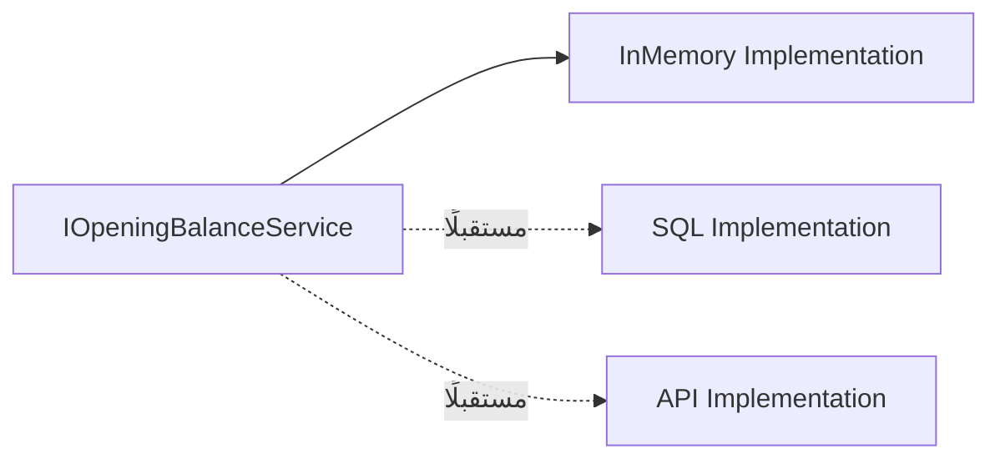

# Architecture Decisions

## 1. Purpose

يوثق هذا الملف القرارات المعمارية الرئيسية التي تم اتخاذها أثناء تصميم وتنفيذ التطبيق. يوضح كل قرار المشكلة أو السياق الذي أدى إليه، والبدائل الممكنة، والقرار المعتمد، والنتائج الإيجابية والقيود المترتبة عليه.

يهدف هذا الأسلوب إلى منع القرارات التقنية من أن تبقى غير موثقة، وتسهيل فهم المشروع على أي مطور أو فريق ينضم لاحقًا إلى العمل.

## 2. Decision Status

| الحالة | المعنى |
| --- | --- |
| `Proposed` | القرار مقترح ولم تتم الموافقة النهائية عليه. |
| `Accepted` | القرار معتمد ويجب أن يكون أساس التنفيذ الحالي. |
| `Superseded` | تم استبدال القرار بقرار أحدث. |
| `Deprecated` | لم يعد القرار مناسبًا، لكن قد يبقى لأسباب توافقية. |

## 3. Decision Summary

| الرمز | القرار | الحالة |
| --- | --- | --- |
| `ADR-001` | اعتماد Clean Architecture | `Accepted` |
| `ADR-002` | استخدام Blazor Web App | `Accepted` |
| `ADR-003` | استخدام Interactive Server | `Accepted` |
| `ADR-004` | استخدام Mock Data في المرحلة الأولية | `Accepted` |
| `ADR-005` | استخدام Dependency Injection | `Accepted` |
| `ADR-006` | دعم اللغة العربية واتجاه RTL | `Accepted` |
| `ADR-007` | فصل Domain وApplication وInfrastructure وPresentation | `Accepted` |
| `ADR-008` | تأجيل Database الدائمة | `Accepted` |
| `ADR-009` | استخدام Mermaid لتوثيق المخططات | `Accepted` |
| `ADR-010` | عدم تنفيذ Authentication وAuthorization الكاملين في المرحلة الأولية | `Accepted` |

---

## ADR-001 — اعتماد Clean Architecture

| العنصر | التفاصيل |
| --- | --- |
| Status | `Accepted` |
| Date | المرحلة الأولية من المشروع |
| Decision Type | Architecture |

### Context

يحتاج التطبيق إلى فصل Business Rules عن واجهة المستخدم ومصدر البيانات، حتى لا يصبح منطق النظام مرتبطًا مباشرة بـBlazor أو Mock Data أو Database مستقبلية.

### Decision

اعتماد **Clean Architecture** لتقسيم المشروع إلى طبقات مستقلة، مع توجيه الاعتماد نحو الداخل.

### Alternatives Considered

| البديل | سبب عدم اعتماده |
| --- | --- |
| وضع كل الكود داخل مشروع واحد | يصعب الاختبار والتوسع ويزيد الترابط. |
| Layered Architecture بسيطة | قد تسمح باعتماد مباشر بين طبقات لا ينبغي أن تعرف تفاصيل بعضها. |
| Feature Folder فقط | مفيدة للتنظيم، لكنها لا تكفي وحدها لحماية اتجاه الاعتماد. |

### Consequences

| النوع | الأثر |
| --- | --- |
| إيجابي | سهولة الاختبار والصيانة والتوسع. |
| إيجابي | إمكانية تغيير Database أو UI دون إعادة كتابة Domain. |
| سلبي | زيادة عدد المشاريع والملفات في البداية. |
| سلبي | الحاجة إلى التزام واضح بحدود الطبقات. |

---

## ADR-002 — استخدام Blazor Web App

| العنصر | التفاصيل |
| --- | --- |
| Status | `Accepted` |
| Date | المرحلة الأولية من المشروع |
| Decision Type | Framework |

### Context

يحتاج التطبيق إلى واجهة ويب تفاعلية باستخدام C# وASP.NET، مع إمكانية تنفيذ العمليات داخل الصفحة وربطها بخدمات التطبيق.

### Decision

اعتماد **Blazor Web App** لبناء الواجهة وتشغيل مكونات Razor ضمن بيئة ASP.NET Core.

### Alternatives Considered

| البديل | سبب عدم اعتماده |
| --- | --- |
| React | يتطلب فصلًا بين TypeScript أو JavaScript وBackend بلغة أخرى. |
| MVC التقليدي | يوفر نمطًا مختلفًا للتفاعل وقد يتطلب إعادة تحميل أكبر للصفحات. |
| Blazor WebAssembly | يحتاج إلى تنفيذ أكبر على جانب العميل، بينما احتياج المرحلة الحالية يناسب Interactive Server. |

### Consequences

| النوع | الأثر |
| --- | --- |
| إيجابي | استخدام C# عبر طبقات التطبيق والواجهة. |
| إيجابي | تكامل مباشر مع ASP.NET Core وDependency Injection. |
| إيجابي | دعم Razor Components والتفاعل داخل الصفحة. |
| قيد | يحتاج النمط التفاعلي إلى اتصال مناسب بالخادم. |

---

## ADR-003 — استخدام Interactive Server

| العنصر | التفاصيل |
| --- | --- |
| Status | `Accepted` |
| Date | المرحلة الأولية من المشروع |
| Decision Type | Blazor Interactivity |

### Context

تحتاج الواجهة إلى إضافة وتعديل وحذف البيانات دون إعادة تحميل كامل للصفحة، مع تنفيذ المنطق داخل الخادم.

### Decision

اعتماد `Interactive Server` لتنفيذ تفاعلات Blazor داخل اتصال تفاعلي مع الخادم.

### Alternatives Considered

| البديل | سبب عدم اعتماده |
| --- | --- |
| Static SSR فقط | لا يوفر التفاعل المطلوب للحقول والأزرار. |
| Interactive WebAssembly | يضيف متطلبات للعميل وحاجة أكبر إلى API عند فصل التنفيذ. |
| JavaScript-heavy UI | يزيد التعقيد ويجعل منطق التفاعل موزعًا بين لغات متعددة. |

### Consequences

| النوع | الأثر |
| --- | --- |
| إيجابي | تنفيذ العمليات بسرعة داخل الصفحة. |
| إيجابي | الوصول المباشر إلى خدمات C# داخل الخادم. |
| قيد | يعتمد التفاعل على استمرارية الاتصال بالخادم. |
| قيد | يتطلب إعداد استضافة مناسبة للاتصالات التفاعلية. |

---

## ADR-004 — استخدام Mock Data في المرحلة الأولية

| العنصر | التفاصيل |
| --- | --- |
| Status | `Accepted` |
| Date | المرحلة الأولية من المشروع |
| Decision Type | Data Strategy |

### Context

لم يتم اعتماد Database نهائية في المرحلة الحالية، مع الحاجة إلى اختبار الواجهة وحالات الإدخال والتحقق والتعديل والحذف.

### Decision

استخدام `Mock Data` وتنفيذ `InMemoryOpeningBalanceService` داخل طبقة `Infrastructure`.

### Alternatives Considered

| البديل | سبب عدم اعتماده حاليًا |
| --- | --- |
| SQL Server | يحتاج إلى إعداد Database وConnection String وMigrations. |
| SQLite | يوفر تخزينًا حقيقيًا لكنه يضيف متطلبات لا تحتاجها النسخة الأولية. |
| API خارجي | غير متوفر ضمن نطاق المرحلة الحالية. |

### Consequences

| النوع | الأثر |
| --- | --- |
| إيجابي | تشغيل سريع دون إعداد Database. |
| إيجابي | تسهيل اختبار الواجهة وحالات الاستخدام. |
| إيجابي | إمكانية استبدال التنفيذ من خلال Interface. |
| سلبي | البيانات لا تستمر بعد إعادة تشغيل التطبيق. |
| سلبي | لا يصلح التنفيذ الحالي للإنتاج دون تخزين دائم. |

---

## ADR-005 — استخدام Dependency Injection

| العنصر | التفاصيل |
| --- | --- |
| Status | `Accepted` |
| Date | المرحلة الأولية من المشروع |
| Decision Type | Dependency Management |

### Context

يجب ألا تقوم صفحات Blazor بإنشاء الخدمات بنفسها أو تعتمد على implementation محدد بصورة مباشرة.

### Decision

تسجيل الخدمات في `Program.cs` وحقنها من خلال `Dependency Injection` باستخدام interfaces.

```csharp
builder.Services.AddScoped<IOpeningBalanceService,
    InMemoryOpeningBalanceService>();
```

### Alternatives Considered

| البديل | سبب عدم اعتماده |
| --- | --- |
| إنشاء الخدمة باستخدام `new` داخل Component | يزيد الترابط ويصعب الاختبار والاستبدال. |
| Static Service | يجعل دورة الحياة والاختبار وإدارة الحالة أكثر صعوبة. |
| Service Locator | يخفي الاعتماديات الفعلية داخل الكود. |

### Consequences

| النوع | الأثر |
| --- | --- |
| إيجابي | سهولة استبدال التنفيذ. |
| إيجابي | دعم Mocking وUnit Testing. |
| إيجابي | وضوح الاعتماديات في المكونات. |
| مسؤولية | يجب تسجيل كل خدمة في Container بصورة صحيحة. |

---

## ADR-006 — دعم اللغة العربية واتجاه RTL

| العنصر | التفاصيل |
| --- | --- |
| Status | `Accepted` |
| Date | المرحلة الأولية من المشروع |
| Decision Type | User Interface |

### Context

المستخدمون المستهدفون يتعاملون مع النظام باللغة العربية، ويجب أن تكون الواجهة والجداول والرسائل مناسبة لاتجاه القراءة من اليمين إلى اليسار.

### Decision

اعتماد العربية كلغة أساسية للواجهة، وضبط `RTL` على مستوى التطبيق والتخطيط والمكونات.

### Alternatives Considered

| البديل | سبب عدم اعتماده |
| --- | --- |
| واجهة إنجليزية فقط | لا تناسب المستخدمين المستهدفين. |
| RTL داخل صفحات محددة فقط | يؤدي إلى اختلافات بصرية وسلوكية بين الصفحات. |
| ترجمة لاحقة | قد تتطلب إعادة تصميم labels والجداول والرسائل. |

### Consequences

| النوع | الأثر |
| --- | --- |
| إيجابي | تحسين تجربة المستخدم العربي. |
| إيجابي | اتساق اتجاه الشاشة والجداول والرسائل. |
| مسؤولية | يجب مراجعة كل مكون جديد للتأكد من توافقه مع RTL. |

---

## ADR-007 — فصل طبقات Domain وApplication وInfrastructure وPresentation

| العنصر | التفاصيل |
| --- | --- |
| Status | `Accepted` |
| Date | المرحلة الأولية من المشروع |
| Decision Type | Layering |

### Context

تحتاج مكونات المشروع إلى أماكن واضحة تمنع وضع Entities داخل الواجهة أو وضع تفاصيل التخزين داخل Business Rules.

### Decision

اعتماد المشاريع والطبقات التالية:

```
Domain
Application
Infrastructure
Presentation / Web
```

### Consequences

| الطبقة | مسؤوليتها |
| --- | --- |
| `Domain` | Entities وBusiness Rules الأساسية. |
| `Application` | Use Cases وInterfaces وValidation. |
| `Infrastructure` | Mock Data وRepositories والتكاملات. |
| `Presentation` | Razor Components وواجهة المستخدم. |

يسمح هذا الفصل بتحديد مكان الكود قبل البدء في تنفيذه، ويقلل الحاجة إلى إعادة التنظيم لاحقًا.

---

## ADR-008 — تأجيل Database الدائمة

| العنصر | التفاصيل |
| --- | --- |
| Status | `Accepted` |
| Date | المرحلة الأولية من المشروع |
| Decision Type | Persistence |

### Context

الهدف الحالي هو بناء الواجهة واختبار التدفقات والقواعد الأساسية قبل اعتماد نموذج Database نهائي.

### Decision

تأجيل Database الدائمة، مع الحفاظ على Interface تسمح باستبدال `Mock Data` لاحقًا.

### Migration Path



### Consequences

| النوع | الأثر |
| --- | --- |
| إيجابي | سرعة بدء التطوير. |
| إيجابي | تقليل قرارات التخزين المبكرة. |
| سلبي | عدم وجود استمرارية للبيانات. |
| عمل مستقبلي | تصميم Schema وMigrations وBackup قبل الإنتاج. |

---

## ADR-009 — استخدام Mermaid لتوثيق المخططات

| العنصر | التفاصيل |
| --- | --- |
| Status | `Accepted` |
| Date | مرحلة التوثيق |
| Decision Type | Documentation |

### Context

يحتاج الفريق إلى مخططات قابلة للتعديل والتخزين داخل GitHub دون الاعتماد على صور غير قابلة للمراجعة أو ملفات تصميم منفصلة.

### Decision

استخدام `Mermaid` داخل ملفات Markdown لتوثيق مخططات Architecture وFlow وSequence وState.

### Consequences

| النوع | الأثر |
| --- | --- |
| إيجابي | المخططات محفوظة كنص داخل Git. |
| إيجابي | يمكن مراجعتها وتعديلها مع الكود. |
| إيجابي | يدعم GitHub عرضها داخل Markdown. |
| قيد | قد تختلف طريقة العرض بين المنصات. |

---

## ADR-010 — تأجيل Authentication وAuthorization الكاملين

| العنصر | التفاصيل |
| --- | --- |
| Status | `Accepted` |
| Date | المرحلة الأولية من المشروع |
| Decision Type | Security |

### Context

تركز النسخة الأولية على تنفيذ تدفقات الأرصدة والواجهة وقواعد البيانات الوهمية، ولم يتم تحديد نظام المستخدمين والصلاحيات النهائي بعد.

### Decision

تأجيل Authentication وAuthorization الكاملين إلى مرحلة لاحقة، مع إبقاء التصميم قابلًا لإضافتهما دون تغيير جوهر Business Rules.

### Consequences

| النوع | الأثر |
| --- | --- |
| إيجابي | تقليل نطاق النسخة الأولية. |
| إيجابي | سرعة اختبار الوظائف الأساسية. |
| قيد | لا تصلح النسخة الحالية للإنتاج الذي يتطلب صلاحيات فعلية. |
| عمل مستقبلي | تحديد الأدوار والصلاحيات وإضافة Identity أو مزود مصادقة. |

---

## 4. قواعد إدارة القرارات

| القاعدة | التطبيق |
| --- | --- |
| كل قرار مهم يحمل رقمًا | استخدم `ADR-001` ثم الرقم التالي. |
| لا تحذف القرار القديم | غيّر حالته إلى `Superseded` عند استبداله. |
| القرار يشرح السبب | يجب توثيق `Context` وليس القرار فقط. |
| القرار يوضح الأثر | اذكر الفوائد والقيود والعمل المستقبلي. |
| التغيير يمر بالمراجعة | راجع القرار مع الفريق قبل اعتماده. |
| التوثيق يتبع الكود | حدّث ADR عند تغيير التصميم الفعلي. |

## 5. Template لإضافة قرار جديد

انسخ القالب التالي عند إضافة قرار معماري جديد:

```markdown
## ADR-XXX — عنوان القرار

| العنصر | التفاصيل |
|---|---|
| Status | Proposed / Accepted / Superseded / Deprecated |
| Date | YYYY-MM-DD |
| Decision Type | Architecture / Data / Security / Deployment / Documentation |

### Context

ما المشكلة أو الحاجة التي أدت إلى القرار؟

### Decision

ما القرار الذي تم اعتماده؟

### Alternatives Considered

| البديل | سبب القبول أو الرفض |
|---|---|
| البديل الأول | السبب |
| البديل الثاني | السبب |

### Consequences

| النوع | الأثر |
|---|---|
| إيجابي | الفائدة |
| سلبي | القيد أو التكلفة |

### Follow-up Work

ما العمل المطلوب لاحقًا نتيجة هذا القرار؟
```

## 6. متى نضيف ADR جديدًا؟

أضف قرارًا جديدًا عندما يؤثر التغيير في بنية المشروع أو طريقة تشغيله أو أمنه أو مصدر بياناته أو قابلية توسعه. لا تحتاج إلى إنشاء ADR لكل تغيير صغير داخل Component أو لكل إصلاح خطأ عادي.

| التغيير | هل يحتاج ADR؟ |
| --- | --- |
| تغيير Database من SQL Server إلى PostgreSQL | نعم. |
| تغيير Blazor Web App إلى WebAssembly | نعم. |
| إضافة API خارجي رئيسي | نعم. |
| اعتماد Authentication جديد | نعم. |
| تغيير طريقة النشر | غالبًا نعم. |
| تعديل لون زر | لا. |
| إصلاح typo في رسالة | لا. |
| إعادة تسمية متغير داخلي | لا، إلا إذا أثرت في العقد العام. |

