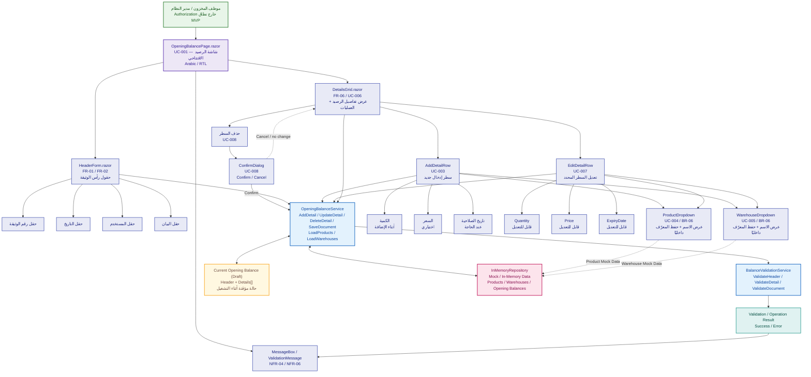

# مخطط بنية المكونات وواجهة المستخدم

> **Component & UI Structure Diagram**  
> يوضح هذا المخطط مكونات واجهة إدارة الأرصدة الافتتاحية وعلاقاتها مع الخدمة، التحقق، الحالة المؤقتة، وبيانات Mock / In-Memory.

## المخطط



---

## شرح المخطط

### 1. المستخدمون

المخطط يبدأ من:

- موظف المخزون.
- مدير النظام.

أما نظام الصلاحيات الكامل فخارج نطاق الـMVP.

### 2. OpeningBalancePage

هي الصفحة الرئيسية التي تجمع:

- `HeaderForm`
- `DetailsGrid`
- رسائل التحقق والعمليات.

### 3. HeaderForm

يمثل بيانات رأس الوثيقة:

- رقم الوثيقة.
- التاريخ.
- المستخدم.
- البيان.

### 4. DetailsGrid

يمثل تفاصيل الرصيد ويتيح:

- إضافة سطر.
- تعديل سطر.
- حذف سطر.
- عرض بيانات التفاصيل.

### 5. AddDetailRow

عند إضافة تفصيل يتم التعامل مع:

- Product.
- Warehouse.
- Quantity.
- Price عند الحاجة.
- ExpiryDate عند الحاجة.

### 6. EditDetailRow

يسمح بتعديل:

- Product.
- Warehouse.
- Quantity.
- Price.
- ExpiryDate.

### 7. ConfirmDialog

يظهر قبل تنفيذ الحذف:

```text
Delete
  ↓
Confirm / Cancel
```

عند `Confirm` تنتقل العملية إلى `OpeningBalanceService`.

وعند `Cancel` تبقى البيانات كما هي.

### 8. OpeningBalanceService

ينسق العمليات الرئيسية:

- `AddDetail`
- `UpdateDetail`
- `DeleteDetail`
- `SaveDocument`
- `LoadProducts`
- `LoadWarehouses`

### 9. BalanceValidationService

مسؤول عن التحقق من:

- Header.
- Detail.
- Document.

ويُرجع نتيجة تحقق بدل التعامل مباشرة مع واجهة المستخدم.

### 10. Validation / Operation Result

يمثل نتيجة العملية:

- Success.
- Error.
- Validation details.

ثم تصل النتيجة إلى واجهة Blazor لعرض الرسالة المناسبة.

### 11. Current Opening Balance (Draft)

يمثل حالة الرصيد الحالي أثناء التشغيل:

```text
Header
Details[]
```

وهو تمثيل تصميمي للبيانات المؤقتة قبل الحفظ ضمن نطاق الـMVP.

### 12. InMemoryRepository

يوفر Mock / In-Memory Data لـ:

- Products.
- Warehouses.
- Opening Balances.

ولا توجد قاعدة بيانات حقيقية في هذه المرحلة.

---

## Traceability

| Requirement / Use Case | Component |
|---|---|
| FR-01 / UC-001 | `OpeningBalancePage.razor` |
| FR-02 / UC-002 | `HeaderForm.razor` |
| FR-03 / UC-003 | `AddDetailRow` |
| FR-04 / UC-004 | `ProductDropdown` |
| FR-05 / UC-005 | `WarehouseDropdown` |
| FR-06 / UC-006 | `DetailsGrid.razor` |
| FR-07 / UC-007 | `EditDetailRow` |
| FR-08 / UC-008 | `Delete` + `ConfirmDialog` |
| FR-09 / UC-009 | `OpeningBalanceService` + `Current Opening Balance (Draft)` + `InMemoryRepository` |

---

## ملاحظات تصميمية

- لا يُفرض تفرد لرقم الوثيقة في هذا المخطط؛ التحليل يذكر عدم التكرار كمسار بديل مشروط.
- لا يتم فرض Composite Unique Key على تفاصيل الرصيد.
- لا تتم إضافة قواعد جديدة للسعر أو تاريخ الصلاحية غير موجودة في التحليل.
- `Product` و`Warehouse` يستخدمان الأسماء في الواجهة مع الاحتفاظ بالمعرفات داخليًا.
- هذا المخطط يمثل **Component & UI Structure**، بينما تفاصيل الـDomain Model والـSequence Diagrams موثقة في مخططات مستقلة.

---

## موقع الملف المقترح

```text
docs/
└── design/
    └── 02-component-ui-structure.md
```
