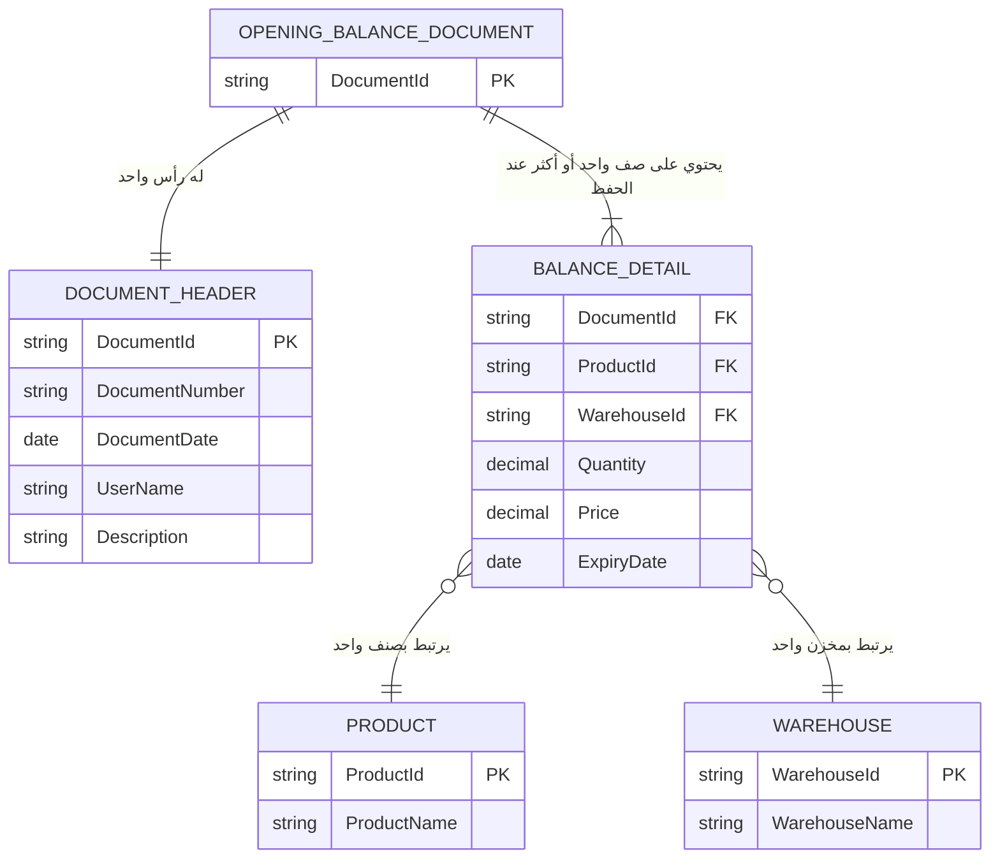

# 03 — Domain / ER Model

## نموذج المجال والعلاقات

يمثل هذا المخطط البنية الأساسية لبيانات الأرصدة الافتتاحية والعلاقات بين الوثيقة والرأس والتفاصيل والأصناف والمخازن.



---

## 1. الكيانات

### OpeningBalanceDocument

يمثل وثيقة الرصيد الافتتاحي.

- `DocumentId`: المعرف الداخلي للوثيقة.

### DocumentHeader

يمثل بيانات رأس الوثيقة:

- `DocumentNumber`: رقم الوثيقة.
- `DocumentDate`: تاريخ الرصيد الافتتاحي.
- `UserName`: اسم المستخدم.
- `Description`: البيان أو الملاحظات.

### BalanceDetail

يمثل سطرًا من تفاصيل الرصيد:

- `ProductId`: معرف الصنف.
- `WarehouseId`: معرف المخزن.
- `Quantity`: الكمية.
- `Price`: السعر، ويمكن أن يكون اختياريًا.
- `ExpiryDate`: تاريخ الصلاحية، ويمكن أن يكون اختياريًا.

### Product

يمثل الصنف المتاح للاختيار:

- `ProductId`
- `ProductName`

### Warehouse

يمثل المخزن المتاح للاختيار:

- `WarehouseId`
- `WarehouseName`

---

## 2. العلاقات

### OpeningBalanceDocument → DocumentHeader

لكل وثيقة رأس واحد.

### OpeningBalanceDocument → BalanceDetail

الوثيقة تحتوي على تفاصيل الرصيد، وعند الحفظ يجب أن تحتوي على صف واحد على الأقل.

### BalanceDetail → Product

كل صف Detail يرتبط بصنف واحد، ويمكن للصنف نفسه أن يظهر في أكثر من صف.

### BalanceDetail → Warehouse

كل صف Detail يرتبط بمخزن واحد، ويمكن للمخزن نفسه أن يرتبط بعدة صفوف.

---

## 3. قواعد العمل المرتبطة بالنموذج

| القاعدة | التطبيق |
|---|---|
| BR-01 | يجب توفير الصنف والمخزن والكمية عند إضافة Detail |
| BR-02 | يجب أن تكون `Quantity > 0` |
| BR-03 | يسمح بتكرار الصنف وفق الشرط المحدد في المتطلبات |
| BR-04 | المخزن مطلوب |
| BR-05 | الصنف مطلوب |
| BR-06 | المعرفات الداخلية محفوظة داخل النظام ولا تعرض للمستخدم |

> هذه قواعد سلوك وتحقق، وليست جميعها قيود قاعدة بيانات.

---

## 4. الحقول الاختيارية

يتم التعامل مع الحقول التالية على أنها اختيارية وفق طبيعة الصنف والمتطلبات:

- `Price`
- `ExpiryDate`

ولا يتم إضافة قيود أخرى غير محددة ضمن المتطلبات.

---

## 5. قيود غير مضافة

لا يتضمن النموذج القيود التالية:

- Unique على `DocumentNumber`.
- Composite Unique Key للتفاصيل.
- اشتراط أن يكون `ExpiryDate` في المستقبل.
- اشتراط `Price >= 0`.
- حقل `DocumentStatus` كجزء من هذا النموذج.

---

## 6. Traceability

| المتطلب / حالة الاستخدام | التمثيل في النموذج |
|---|---|
| FR-02 / UC-002 | `DocumentHeader` |
| FR-03 / UC-003 | `BalanceDetail` |
| FR-04 / UC-004 | `Product` |
| FR-05 / UC-005 | `Warehouse` |
| FR-06 / UC-006 | `BalanceDetail` |
| FR-07 / UC-007 | تحديث `BalanceDetail` |
| FR-08 / UC-008 | حذف `BalanceDetail` |
| FR-09 / UC-009 | `OpeningBalanceDocument` + `BalanceDetail` |

---

## 7. اتساق النموذج مع بقية التصميم

يجب أن تستخدم المخططات التصميمية التالية نفس الأسماء الأساسية:

```text
OpeningBalanceDocument
DocumentHeader
BalanceDetail
Product
Warehouse
```

ويجب أن تبقى العلاقات وقواعد التحقق متسقة مع هذا النموذج في:

- Component & Layered Architecture
- Component / UI Structure
- Activity / User Flow
- Sequence Diagrams

---

## 8. نطاق النموذج

هذا النموذج خاص بنطاق الـMVP، ولا يتضمن:

- قاعدة بيانات حقيقية.
- API.
- نظام صلاحيات متكامل.
- عمليات الشراء أو البيع.
- ترحيل فعلي للمخزون.
- أي بنية إضافية خارج نطاق المتطلبات.
