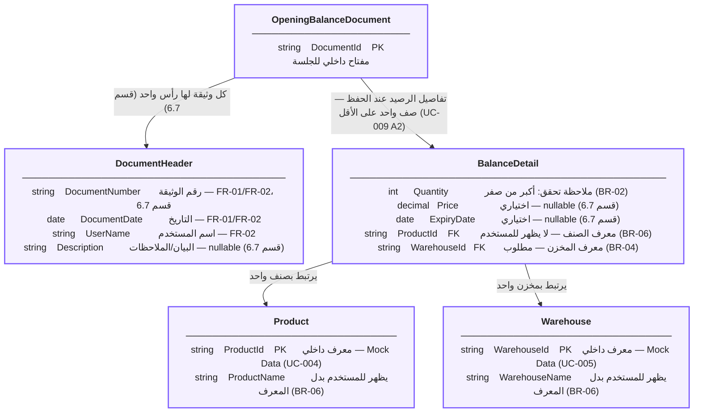

# 03 — Domain / ER Model

## نموذج المجال والعلاقات

يمثل هذا المخطط البنية الأساسية لبيانات الأرصدة الافتتاحية والعلاقات بين وثيقة الرصيد والرأس والتفاصيل والأصناف والمخازن.



---

## العلاقات

- **OpeningBalanceDocument → DocumentHeader:** كل وثيقة لها رأس واحد.
- **OpeningBalanceDocument → BalanceDetail:** عند الحفظ تحتوي الوثيقة على صف واحد على الأقل.
- **BalanceDetail → Product:** كل Detail يرتبط بصنف واحد.
- **BalanceDetail → Warehouse:** كل Detail يرتبط بمخزن واحد.

---

## Business Rules المرتبطة بالنموذج

| القاعدة | التطبيق |
|---|---|
| BR-02 | `Quantity > 0` |
| BR-03 | يسمح بتكرار الصنف وفق اختلاف السعر/تاريخ الصلاحية |
| BR-04 | `Warehouse` مطلوب |
| BR-06 | المعرفات الداخلية لا تظهر للمستخدم |

---

## الحقول الاختيارية

- `Price`
- `ExpiryDate`
- `Description`

ولا يتم فرض قيود إضافية غير محددة ضمن المتطلبات.

---

## قيود التصميم

لا يتضمن النموذج:

- Unique على `DocumentNumber`.
- Composite Unique Key على تفاصيل الرصيد.
- شرط أن يكون `ExpiryDate` في المستقبل.
- شرط `Price >= 0`.
- `DocumentStatus` كحقل مستقل.

---

## Traceability

| المتطلب / حالة الاستخدام | التمثيل |
|---|---|
| FR-02 / UC-002 | `DocumentHeader` |
| FR-03 / UC-003 | `BalanceDetail` |
| FR-04 / UC-004 | `Product` |
| FR-05 / UC-005 | `Warehouse` |
| FR-06 / UC-006 | `BalanceDetail` |
| FR-07 / UC-007 | تحديث `BalanceDetail` |
| FR-08 / UC-008 | حذف `BalanceDetail` |
| FR-09 / UC-009 | `OpeningBalanceDocument` + `BalanceDetail` |

---

## موقع الملف

```text
docs/
└── design/
    └── 03-domain-er-model.md
```
