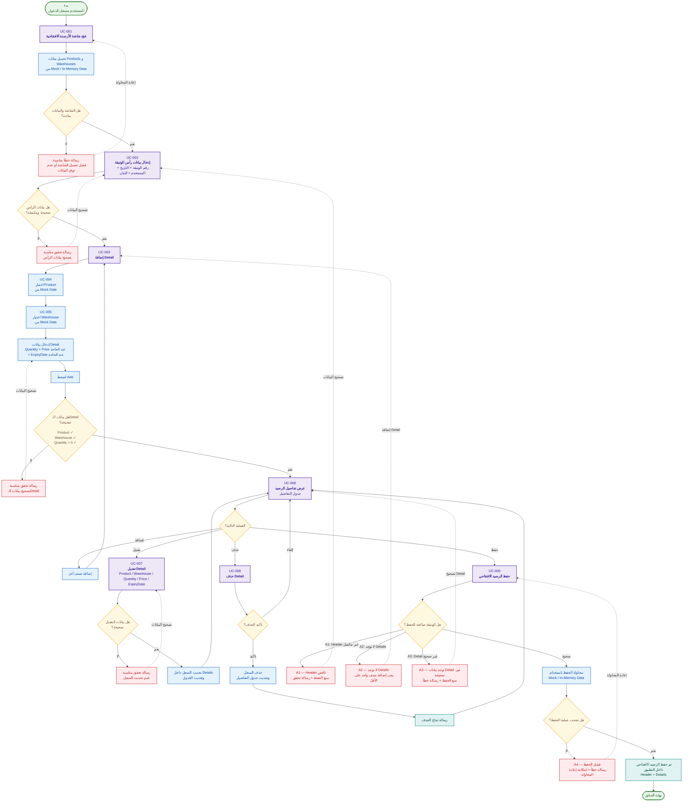

# 04 — Activity / Main User Flow

## تدفق المستخدم والعمليات الرئيسية

يمثل هذا المخطط التدفق الرئيسي لاستخدام ميزة **إدارة الأرصدة الافتتاحية**، مع تغطية حالات الاستخدام `UC-001` إلى `UC-009` والمسارات البديلة والرسائل الناتجة عن حالات الخطأ.



---

## 1. قراءة التدفق

### UC-001 — فتح الشاشة

يبدأ المستخدم بفتح شاشة الأرصدة الافتتاحية، ثم يقوم النظام بتحميل بيانات الأصناف والمخازن الوهمية.

إذا فشل التحميل أو لم تتوفر البيانات، تظهر رسالة مناسبة ويمكن إعادة المحاولة.

### UC-002 — إدخال Header

يدخل المستخدم:

- رقم الوثيقة.
- التاريخ.
- المستخدم.
- البيان/الملاحظات.

يتم التحقق من صحة واكتمال بيانات الرأس قبل الانتقال إلى إضافة التفاصيل.

لا يفرض هذا التدفق تفرد رقم الوثيقة؛ عدم التكرار ورد في التحليل كمسار بديل مشروط.

### UC-003 / UC-004 / UC-005 — إضافة Detail

يمر الإدخال بالتسلسل:

```text
اختيار Product
        ↓
اختيار Warehouse
        ↓
إدخال Quantity
        ↓
Price / ExpiryDate عند الحاجة
        ↓
Add
        ↓
Validation
```

التحقق الأساسي المرتبط بالتفاصيل:

- Product مطلوب.
- Warehouse مطلوب.
- Quantity يجب أن تكون أكبر من صفر.

### UC-006 — عرض التفاصيل

بعد نجاح الإضافة يظهر السجل في جدول التفاصيل، ويستطيع المستخدم الاستمرار في العمل على الوثيقة.

### UC-007 — التعديل

يسمح للمستخدم بتعديل بيانات السطر ثم إعادة التحقق منها قبل تحديث الجدول.

### UC-008 — الحذف

يظهر تأكيد قبل الحذف:

```text
Delete
  ↓
Confirm / Cancel
```

عند التأكيد يحذف السجل ويتم تحديث الجدول وتظهر رسالة نجاح.
وعند الإلغاء تبقى البيانات كما هي.

### UC-009 — الحفظ

قبل الحفظ يتم التحقق من الوثيقة وفق المسارات البديلة:

- **A1:** بيانات Header ناقصة.
- **A2:** لا توجد Details.
- **A3:** توجد بيانات Detail غير صحيحة.
- **A4:** فشل الحفظ في Mock / In-Memory Data.

عند نجاح الحفظ يتم الاحتفاظ ببيانات Header وDetails داخل التطبيق.

---

## 2. Traceability

| المصدر | الجزء في التدفق |
|---|---|
| FR-01 / UC-001 | فتح الشاشة وتحميل Mock Data |
| FR-02 / UC-002 | إدخال والتحقق من Header |
| FR-03 / UC-003 | إضافة Detail |
| FR-04 / UC-004 | اختيار Product |
| FR-05 / UC-005 | اختيار Warehouse |
| FR-06 / UC-006 | عرض Details |
| FR-07 / UC-007 | تعديل Detail |
| FR-08 / UC-008 | حذف Detail + Confirmation |
| FR-09 / UC-009 | التحقق والحفظ |

---

## 3. ملاحظات تصميمية

- الرسم يركز على السلوك الوظيفي للمستخدم، وليس على تفاصيل طبقات النظام.
- لا يتضمن هذا المخطط قاعدة بيانات حقيقية أو API أو بنية خارج نطاق الـMVP.
- قواعد التحقق والرسائل يجب أن تبقى متوافقة مع وثيقة المتطلبات.
- تفاصيل التنفيذ الداخلية للخدمات تظهر في مخطط المعمارية ومخططات التسلسل.
- أي تغيير في التدفق يجب أن يراجع مقابل حالات الاستخدام وقواعد العمل قبل التنفيذ.

---

## 4. موقع الملف

```text
docs/
└── design/
    └── 04-activity-main-user-flow.md
```
