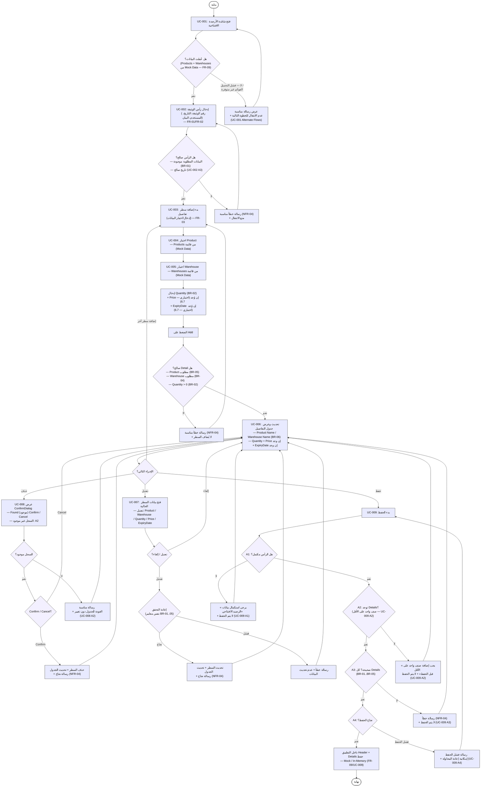

# 04 — Activity / Main User Flow

## تدفق المستخدم الرئيسي

يمثل هذا المخطط التدفق التشغيلي الرئيسي لميزة إدارة الأرصدة الافتتاحية، من فتح الشاشة وإدخال الرأس وإضافة التفاصيل، مرورًا بالتعديل والحذف، وانتهاءً بعملية الحفظ والتحقق من حالات الفشل.

## المخطط



---

## 1. نطاق المخطط

يغطي المخطط دورة العمل الرئيسية التالية:

```text
فتح الشاشة
    ↓
تحميل البيانات الوهمية
    ↓
إدخال رأس الوثيقة
    ↓
إضافة التفاصيل
    ↓
عرض التفاصيل
    ↓
إضافة / تعديل / حذف
    ↓
حفظ الرصيد الافتتاحي
    ↓
نجاح أو معالجة خطأ
```

---

## 2. UC-001 — فتح الشاشة

يبدأ التدفق بفتح شاشة الأرصدة الافتتاحية ثم التحقق من توفر بيانات:

- Products
- Warehouses

المصدر هو Mock Data.

عند فشل التحميل أو عدم توفر القوائم، يتم عرض رسالة مناسبة وعدم الانتقال إلى الخطوة التالية.

---

## 3. UC-002 — إدخال رأس الوثيقة

يدخل المستخدم:

- رقم الوثيقة.
- التاريخ.
- المستخدم.
- البيان.

يتم التحقق من البيانات قبل الانتقال إلى إضافة التفاصيل.

---

## 4. UC-003 / UC-004 / UC-005 — إضافة Detail

يتبع إضافة السطر التسلسل التالي:

```text
اختيار Product
      ↓
اختيار Warehouse
      ↓
إدخال Quantity
      ↓
Price عند الحاجة
      ↓
ExpiryDate عند الحاجة
      ↓
Add
      ↓
Validation
```

قواعد التحقق الظاهرة في المخطط:

- Product مطلوب.
- Warehouse مطلوب.
- Quantity > 0.

---

## 5. UC-006 — عرض التفاصيل

بعد نجاح إضافة السطر، يتم تحديث جدول التفاصيل لعرض:

- Product Name.
- Warehouse Name.
- Quantity.
- Price عند وجوده.
- ExpiryDate عند وجوده.

---

## 6. UC-007 — تعديل Detail

يمكن للمستخدم تعديل:

- Product.
- Warehouse.
- Quantity.
- Price.
- ExpiryDate.

ثم تتم إعادة عملية التحقق قبل تحديث السجل والجدول.

---

## 7. UC-008 — حذف Detail

يتضمن الحذف:

```text
حذف
  ↓
التحقق من وجود السجل
  ↓
Confirm / Cancel
```

### Confirm

- حذف السطر.
- تحديث الجدول.
- عرض رسالة نجاح.

### Cancel

- العودة إلى الجدول.
- عدم تغيير البيانات.

### السجل غير موجود

- عرض رسالة مناسبة.
- العودة إلى الجدول دون تغيير.

---

## 8. UC-009 — الحفظ

يمر الحفظ عبر أربع حالات بديلة:

### A1 — Header غير مكتمل

لا يتم الحفظ، وتظهر رسالة:

> «يرجى استكمال بيانات الرصيد الافتتاحي»

### A2 — لا توجد Details

لا يتم الحفظ، وتظهر رسالة:

> «يجب إضافة صنف واحد على الأقل قبل الحفظ»

### A3 — تفاصيل غير صحيحة

يتم منع الحفظ مع عرض رسالة توضح المشكلة.

### A4 — فشل الحفظ

تظهر رسالة فشل الحفظ مع إمكانية إعادة المحاولة.

### النجاح

يتم حفظ:

```text
Header + Details
```

داخل التطبيق باستخدام:

```text
Mock / In-Memory Data
```

---

## 9. Traceability

| المتطلب / حالة الاستخدام | الجزء في المخطط |
|---|---|
| FR-01 / UC-001 | فتح شاشة الأرصدة الافتتاحية |
| FR-02 / UC-002 | إدخال رأس الوثيقة |
| FR-03 / UC-003 | بدء وإكمال إضافة Detail |
| FR-04 / UC-004 | اختيار Product |
| FR-05 / UC-005 | اختيار Warehouse |
| FR-06 / UC-006 | تحديث وعرض جدول التفاصيل |
| FR-07 / UC-007 | تعديل Detail |
| FR-08 / UC-008 | Confirm / Cancel ثم الحذف |
| FR-09 / UC-009 | التحقق والحفظ |

---

## 10. المراجع

يتوافق هذا التدفق مع حالات الاستخدام والمتطلبات المرتبطة بميزة الأرصدة الافتتاحية، مع الحفاظ على Mock Data / In-Memory ضمن نطاق التنفيذ.

---

## 11. موقع الملف

```text
docs/
└── design/
    └── 05-activity-main-user-flow.md
```
