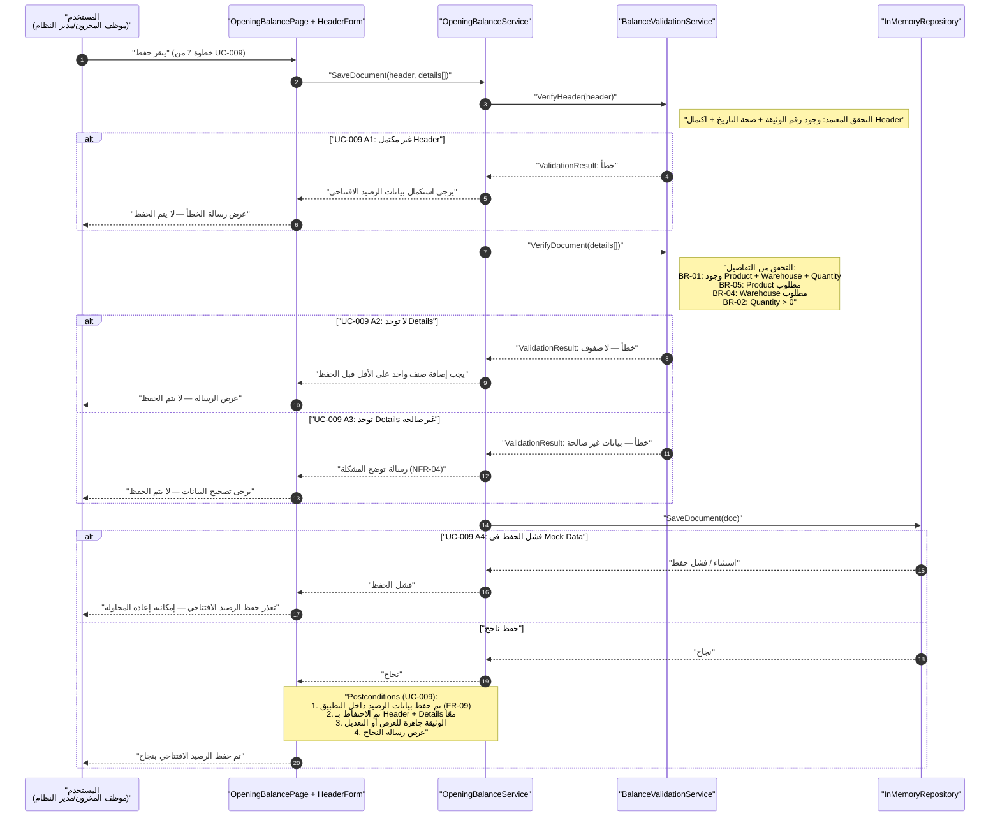

# 06 — Sequence Diagram: Save Opening Balance

## مخطط التسلسل — حفظ الرصيد الافتتاحي

يوضح هذا المخطط تسلسل عملية حفظ بيانات الرصيد الافتتاحي، بدءًا من ضغط المستخدم على زر الحفظ، مرورًا بالتحقق من بيانات الرأس والتفاصيل، ثم تنفيذ الحفظ في `InMemoryRepository` وإرجاع النتيجة للمستخدم.

## المخطط



---

## 1. الأطراف المشاركة

| المشارك | المسؤولية |
|---|---|
| المستخدم | يبدأ عملية الحفظ ويتلقى النتيجة |
| `OpeningBalancePage + HeaderForm` | يستقبل طلب الحفظ ويعرض نتائج العملية |
| `OpeningBalanceService` | ينسق عملية التحقق والحفظ |
| `BalanceValidationService` | يتحقق من Header وDetails |
| `InMemoryRepository` | ينفذ التخزين ضمن Mock / In-Memory Data |

---

## 2. المسار الرئيسي

```text
User
  ↓
OpeningBalancePage
  ↓
OpeningBalanceService
  ↓
VerifyHeader
  ↓
VerifyDocument
  ↓
SaveDocument
  ↓
InMemoryRepository
  ↓
Success
  ↓
Message to User
```

---

## 3. المسارات البديلة

### UC-009 A1 — Header غير مكتمل

إذا كانت بيانات الرأس غير مكتملة:

- يتم رفض عملية الحفظ.
- تعرض رسالة:
  `يرجى استكمال بيانات الرصيد الافتتاحي`
- يعود المستخدم إلى حالة التعديل.

### UC-009 A2 — لا توجد Details

إذا كانت الوثيقة تحتوي على Header فقط دون تفاصيل:

- يتم رفض الحفظ.
- تعرض رسالة:
  `يجب إضافة صنف واحد على الأقل قبل الحفظ`

### UC-009 A3 — تفاصيل غير صحيحة

إذا كانت التفاصيل موجودة ولكن تحتوي على بيانات غير صحيحة:

- يتم رفض الحفظ.
- تعرض رسالة توضح المشكلة.
- يجب تصحيح البيانات قبل إعادة الحفظ.

### UC-009 A4 — فشل الحفظ

إذا حدث فشل أثناء التخزين في Mock / In-Memory Data:

- تعاد نتيجة فشل.
- تعرض رسالة فشل الحفظ.
- يمكن إعادة المحاولة.

---

## 4. نجاح الحفظ

عند نجاح العملية:

- يتم حفظ بيانات الرصيد داخل التطبيق.
- يتم الاحتفاظ ببيانات Header وDetails معًا.
- تصبح الوثيقة جاهزة للعرض أو التعديل.
- تظهر رسالة نجاح للمستخدم.

---

## 5. Traceability

| المرجع | التمثيل في المخطط |
|---|---|
| UC-009 | التدفق الرئيسي للحفظ |
| UC-009 A1 | التحقق من Header |
| UC-009 A2 | التحقق من وجود Details |
| UC-009 A3 | التحقق من صحة Details |
| UC-009 A4 | فشل الحفظ في Mock Data |
| FR-09 | الحفظ داخل التطبيق باستخدام Mock / In-Memory |
| BR-01 | Product + Warehouse + Quantity |
| BR-02 | Quantity > 0 |
| BR-04 | Warehouse مطلوب |
| BR-05 | Product مطلوب |
| NFR-04 | رسائل النجاح والخطأ المفهومة |

---

## 6. موقع الملف

```text
docs/
└── design/
    └── 06-sequence-save-opening-balance.md
```
