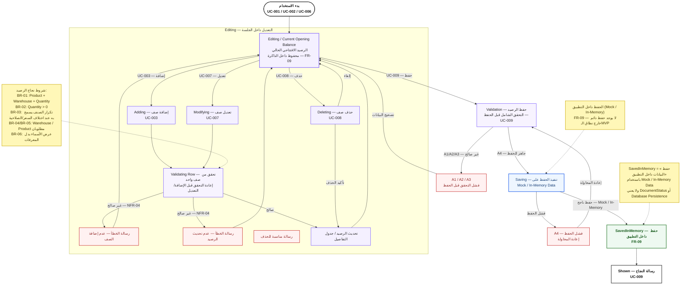

# 07 — Session / State Flow

## مخطط حالة وتدفق الرصيد الافتتاحي أثناء الجلسة

يوضح هذا المخطط دورة حياة الرصيد الافتتاحي داخل التطبيق أثناء العمل، بدءًا من فتح الشاشة وإنشاء/تعديل البيانات، مرورًا بعمليات الإضافة والتعديل والحذف والتحقق، ثم الانتقال إلى الحفظ داخل `Mock / In-Memory Data` وعرض نتيجة النجاح.

> يمثل المخطط **حالة العمل داخل التطبيق** وليس `DocumentStatus` أو نظام تخزين دائم.



---

## 1. الحالات الرئيسية

### Editing

تمثل حالة الرصيد الافتتاحي الحالي أثناء العمل داخل التطبيق.

وتشمل:

- Header.
- Details.
- التعديلات الحالية.
- البيانات الموجودة في الذاكرة أثناء الجلسة.

وترتبط مباشرة بـ:

- `UC-001`
- `UC-002`
- `UC-006`
- `FR-09`

---

### Adding

تمثل عملية إضافة صف تفاصيل جديد وفق `UC-003`.

المسار:

```text
Editing
   ↓
Adding
   ↓
Validating Row
```

---

### Modifying

تمثل تعديل صف موجود وفق `UC-007`.

بعد التعديل يتم إعادة التحقق قبل تحديث بيانات الرصيد.

---

### Deleting

تمثل حذف صف وفق `UC-008`.

يدعم:

- Confirm.
- Cancel.

عند التأكيد يتم حذف الصف وتحديث جدول التفاصيل.

---

### Validating Row

تمثل التحقق من صف التفاصيل قبل الإضافة أو التعديل.

تشمل القواعد المرتبطة في التحليل:

- Product مطلوب.
- Warehouse مطلوب.
- Quantity مطلوبة.
- `Quantity > 0`.
- قواعد التكرار حسب `BR-03`.

---

### Saving

تمثل عملية الحفظ بعد اكتمال التحقق الشامل للوثيقة.

الحفظ يتم باستخدام:

```text
Mock / In-Memory Data
```

ولا يمثل Database Persistence.

---

### SavedInMemory

تمثل نجاح الحفظ **داخل التطبيق**.

وجود هذه الحالة لا يعني وجود:

```text
DocumentStatus
Database
Permanent Persistence
```

بل تمثل فقط أن عملية `UC-009` نجحت ضمن نطاق الـMVP.

---

### Shown

تمثل عرض نتيجة النجاح للمستخدم بعد اكتمال الحفظ.

---

## 2. حالات الفشل

### A1 / A2 / A3 — فشل التحقق قبل الحفظ

إذا لم تكتمل بيانات الرصيد أو لم توجد تفاصيل أو كانت التفاصيل غير صحيحة:

```text
Save
 ↓
Validation
 ↓
Error
 ↓
Editing
```

ويعود المستخدم لتصحيح البيانات.

### A4 — فشل الحفظ

إذا حدث خطأ أثناء الحفظ داخل `Mock / In-Memory Data`:

```text
Saving
  ↓
A4 — Save Error
  ↓
Retry
  ↓
Validation
```

---

## 3. Business Rules المرتبطة

| القاعدة | أثرها في التدفق |
|---|---|
| BR-01 | Product + Warehouse + Quantity مطلوبة |
| BR-02 | Quantity > 0 |
| BR-03 | يسمح بالتكرار عند اختلاف السعر أو تاريخ الصلاحية |
| BR-04 | Warehouse مطلوب |
| BR-05 | Product مطلوب |
| BR-06 | عرض الأسماء بدل المعرفات الداخلية |

---

## 4. Traceability

| المصدر | الحالة / الانتقال |
|---|---|
| UC-001 | بداية استخدام الشاشة |
| UC-002 | إنشاء بيانات الرأس |
| UC-003 | Adding |
| UC-007 | Modifying |
| UC-008 | Deleting |
| UC-009 | Validation → Saving → SavedInMemory → Shown |
| FR-09 | الاحتفاظ بالبيانات داخل التطبيق وMock / In-Memory |

---

## 5. حدود الـMVP

هذا المخطط لا يفترض:

- قاعدة بيانات حقيقية.
- API.
- تخزين دائم خارج نطاق الـMVP.
- `DocumentStatus` كحقل Domain.
- Persistence خارجي.

التركيز هنا على **حالة العمل داخل التطبيق أثناء الجلسة** وعلى نتيجة الحفظ داخل `Mock / In-Memory Data`.

---

## 6. موقع الملف

```text
docs/
└── design/
    └── 07-state-session-flow.md
```
