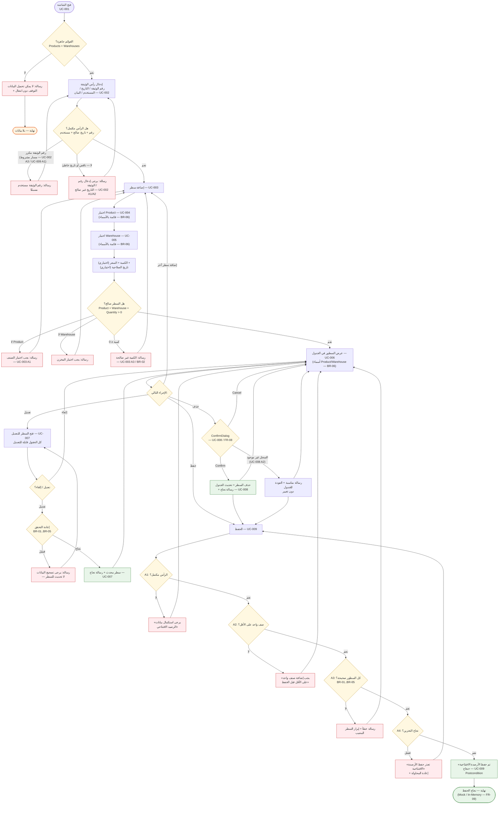

# 03 — UX User Flow

| البند | القيمة |
|---|---|
| المرجع الأول | Activity/User Flow المعاد بناؤه (المخطط المعتمد من حزمة التصميم) |
| المرجع الثاني | `task.pdf` — UC-001..009 بمساراتها البديلة |
| النطاق | الشاشة الأساسية: Opening Balance Main Screen (شاشة واحدة) |
| الإعداد | Manus AI |

---

## 1. User Flow — Mermaid Source

## 2. تغطية الحالات المطلوبة

| الحالة المطلوبة | مكانها في الـ Flow | المصدر |
|---|---|---|
| Happy Path | Open → Header → Add → Validate → Grid → Save → Success | UC-001..009 |
| Missing Header | بوابة CK1/A1 → «يرجى استكمال بيانات الرصيد الافتتاحي» | UC-009 A1 + UC-002 A1 |
| Missing Product | بوابة H3 → «يجب اختيار الصنف» | UC-003 A1 / BR-05 |
| Missing Warehouse | بوابة H3 → «يجب اختيار المخزن» | UC-003 A2 / BR-04 |
| Invalid Quantity | بوابة H3 → «الكمية غير صالحة» | UC-003 A3 / BR-02 |
| Empty Details | بوابة CK2/A2 → «يجب إضافة صنف واحد على الأقل» | UC-009 A2 |
| Invalid Detail | بوابة CK3/A3 → رسالة + إبراز السطر المعيب | UC-009 A3 |
| Delete / Cancel | DLG → Cancel → العودة للجدول دون تغيير | UC-008 A1 |
| Delete / Confirm | DLG → Confirm → حذف + رسالة نجاح | UC-008 Main Flow |
| Save Failure | CK4/A4 → «تعذر حفظ الأرصدة الافتتاحية» + إعادة المحاولة | UC-009 A4 |
| Save Success | «تم حفظ الأرصدة الافتتاحية بنجاح» — نهاية الجلسة | UC-009 Postcondition |
| رقم الوثيقة مكرر (مشروط) | بوابة H2 → «رقم الوثيقة مستخدم مسبقًا» | UC-002 A3 / UC-009 A1 — **مسار مشروط (OD-1 مفتوح)** |

> **تنبيه اتساق:** «رقم الوثيقة مكرر» مسار بديل مشروط في التحليل («في حالة تطبيق قاعدة عدم التكرار» — UC-002 A3) وليس قاعدة Business Rule من BR-01..BR-06؛ لذلك يظهر في الـ Flow كبوابة ثانوية تحت بوابة الرأس لا كبوابة رئيسية إلزامية — وهذا قرار تصميمي موثق (UX Decision #3 في وثيقة 08).
>
> **ما لا يظهر عمدًا:** لا توجد حالة «حذف متعدد» كجزء من الـ Flow الرئيسي رغم ذكرها في UC-008 A3 («حدد السطور ثم احذف»)؛ التعامل معها يكون برسالة واحدة عند محاولة حذف سطر غير موجود — قرار مذكور في UX Decisions #9.

## 3. قواعد الانتقال UX

1. كل خطأ يعيد المستخدم إلى نقطة الإدخال ذاتها مع تحديد معيب؛ لا يقفز التدفق بعيدًا (NFR-04).
2. الإلغاء في أي نقطة (Cancel، إلغاء تعديل) يعيد البيانات لحالتها السابقة دون أثر.
3. الحفظ الوحيد المسموح به هو زر «حفظ» الأعلى/المثبت؛ لا يوجد حفظ تلقائي ولا مسودة مرئية بكيان مستقل (FR-09 — الحالة جلسة لا كيان).
4. بعد نجاح الحفظ تبقى الشاشة قابلة للعرض والتعديل داخل نفس الجلسة (UC-009 Postconditions: «الوثيقة جاهزة للعرض/التعديل»).
